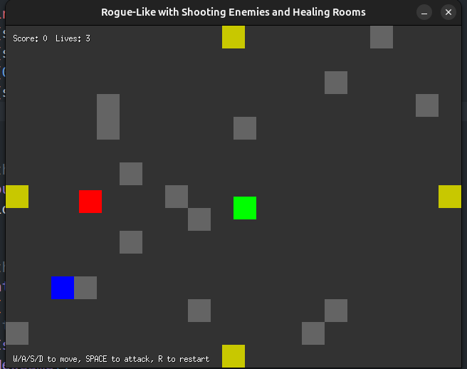
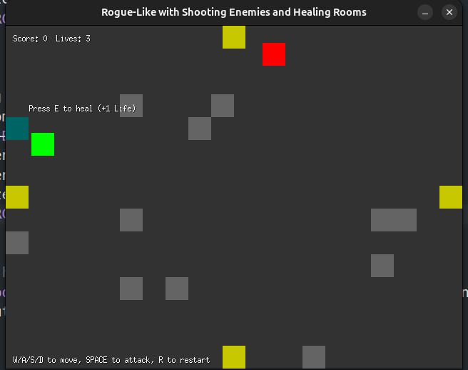
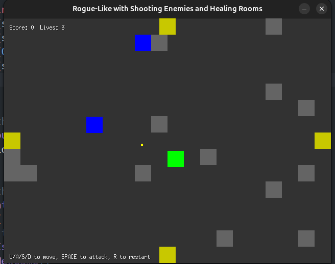
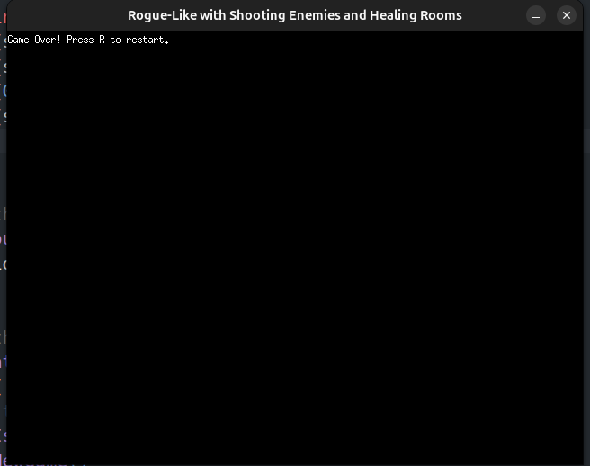

фичи игры:

- **Движение игрока:** Управление с помощью клавиш **W/A/S/D**.
- **Атака:** Атаковать врагов можно, нажав **пробел**.
- **Восстановление здоровья:** Приближаясь к лечебным клеткам, нажмите **E** для восстановления жизни.
- **Враги:** 
  - **Преследование:** Враги автоматически движутся в направлении игрока.
  - **Стрельба:** Некоторые враги способны стрелять по игроку.
- **Переход между комнатами:** Плавный переход через двери (верх, низ, лево, право) между различными комнатами.
- **Случайная генерация комнат:** Каждая комната генерируется случайным образом с размещением стен и дверей.
- **Лечебные клетки:** В некоторых комнатах могут появляться лечебные клетки с шансом 10%.
- **Лечебные клетки имеют описание**
- **Система очков:** Набирайте очки за уничтожение врагов.
- **Система жизней:** У игрока есть ограниченное количество жизней. При потере всех жизней игра заканчивается с возможностью перезапуска.
- **Кулдауны:** 
  - **Атаки:** После атаки необходимо ожидать некоторое время перед следующей.
  - **Получение урона:** После получения урона игрок становится временно неуязвимым.
- **Пули:** Враги могут стрелять пулями, которые движутся в направлении игрока и наносят урон при столкновении.
- **Логирование событий:** Важные события (переходы между комнатами, атаки, получение урона и т.д.) фиксируются в консоли для отладки.

## Скриншоты из игры:
начало игры: вы - зеленая клетка, переходы - желтая клетка, враг - красная клетка, стреляющий враг - синяя клетка

лечащая клетка с описанием - бирюзовая клетка

(небольшой пиксель это снаряд)

смерть

