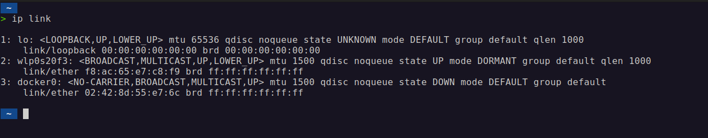

# Отчет: Поиск MAC-адреса, выполнение запроса и просмотр таблицы ARP на Ubuntu

## 1. Поиск MAC-адреса активного сетевого интерфейса

**Шаг 1**: Открыл терминал и выполнил команду для просмотра списка сетевых интерфейсов:

```
ip link
```
**Результат**:  
Список всех сетевых интерфейсов системы выводится на экран, включая их MAC-адреса. Активный интерфейс, такой как `eth0`, `wlan0` или `enp3s0`, имеет строку вида `link/ether` рядом с ним, где указан MAC-адрес.

**Пример результата (скриншот)**:  


---

## 2. Выполнение запроса к устройству в локальной сети

### Шаг 2.1: Нашел IP-адрес шлюза (роутера)

Выполнил команду:

```
ip route | grep default
```

**Результат**:  
Выводится маршрут по умолчанию с IP-адресом шлюза, который выглядит как `192.168.0.1` или другой адрес в вашей сети.

**Пример результата (скриншот)**:  


### Шаг 2.2: Выполнил команду ping для проверки связи с роутером

```
ping <ip-адрес-шлюза>
```

**Результат**:  
Команда отправляет пакеты на указанный IP-адрес, и система возвращает данные о времени отклика, показывая успешное подключение.

**Пример результата (скриншот)**:  


---

## 3. Просмотр таблицы ARP

**Шаг 3**: После выполнения команды ping выполнил команду:

```
ip neigh
```

**Результат**:  
Таблица ARP отображает соответствие IP-адресов и MAC-адресов устройств в локальной сети. Среди них находится IP-адрес шлюза и его MAC-адрес.

**Пример результата (скриншот)**:  


