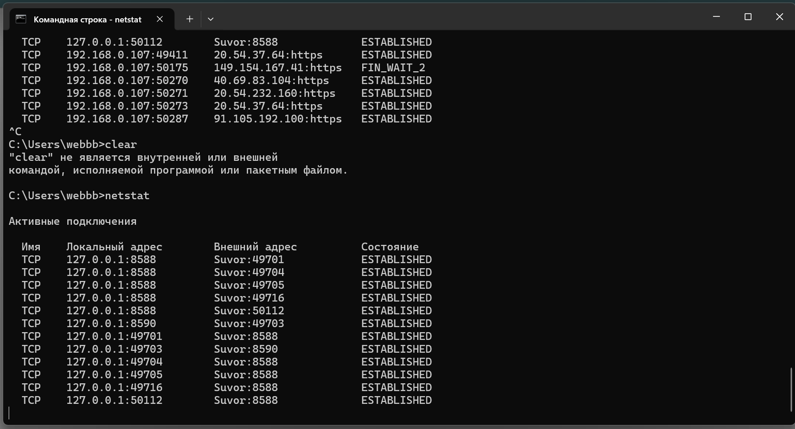
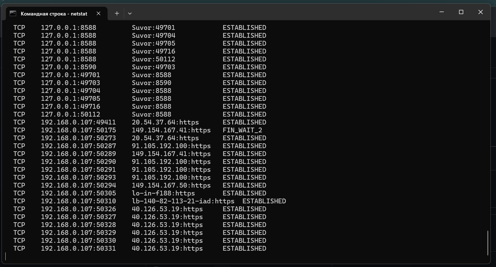
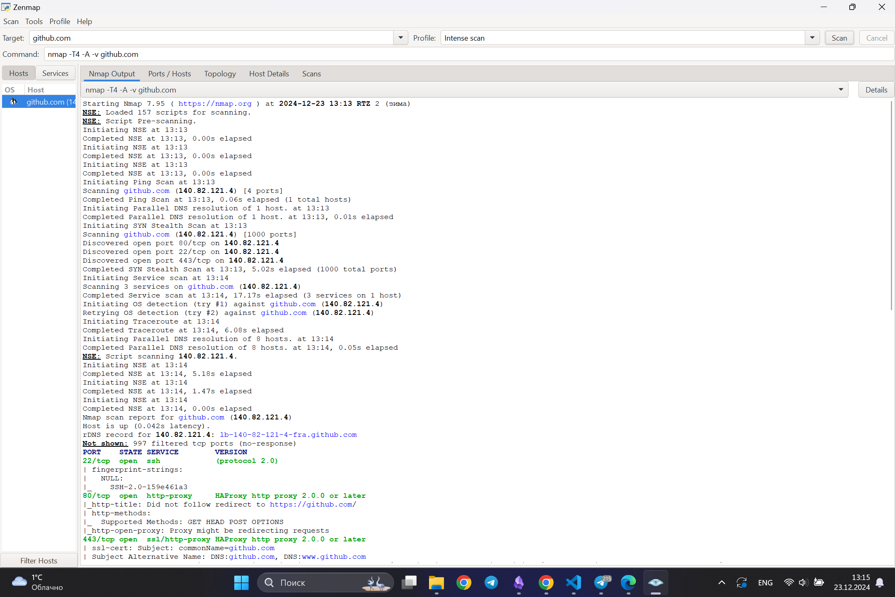

# netstat
данные подключения:

далее я зашел на несколько сайтов:

# nmap

- **22/tcp (ssh)**: Открыт для удалённого доступа по SSH (предположительно, для взаимодействия с репозиториями через ключи SSH на GitHub).
- **80/tcp (http)**: Открыт для стандартного веб-доступа без шифрования. Возможно, используется для редиректа на HTTPS.
- **443/tcp (https)**: Открыт для защищённого веб-доступа через HTTPS. Основной порт для шифрованного доступа к веб-сервисам GitHub.
