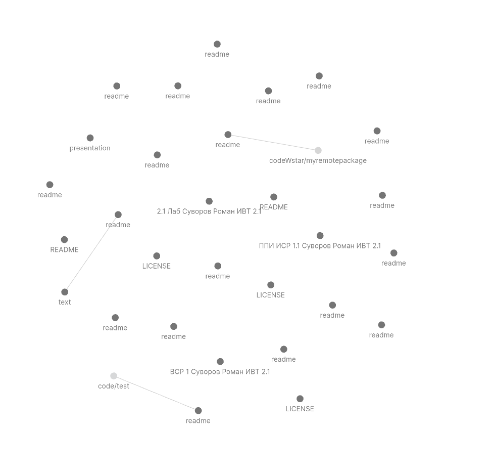

## Презентация: Obsidian — современный инструмент для работы с заметками и знаниями

###### Суворов, Адаменко, Гневков

---

##  Введение в Obsidian

- **Obsidian** — это приложение для создания, хранения и работы с заметками в формате Markdown.
- Поддерживает сложные связи между заметками и позволяет создавать базы знаний.
- Подходит как для личного, так и для командного использования.

---

##  Преимущества Markdown в Obsidian

- **Простой синтаксис** для форматирования текста.
- Лёгкое создание **структурированных данных**.
- Поддержка **общепринятого формата** для обмена заметками.
- Полностью **открытый и кроссплатформенный формат**.

---

##  Плагины и их роль

- **Плагины** расширяют функционал Obsidian.
- Возможности плагинов:
  - Поддержка **визуализации графов**,
  - Интеграции с **календарями и задачами**,
  - Дополнительные функции для **анализа данных**.
- Пользователи могут устанавливать и создавать плагины.

---

## Работа с графами знаний 
**Графы знаний** — это визуализация связей между заметками. - Позволяют увидеть всю структуру базы знаний. - Упрощают поиск и исследование связанных идей. - Доступны фильтры для выделения отдельных тем или проектов.

---

---
##  Синхронизация и GitHub

- Синхронизация заметок между устройствами через **GitHub**.

 подробная инстукция:

  
