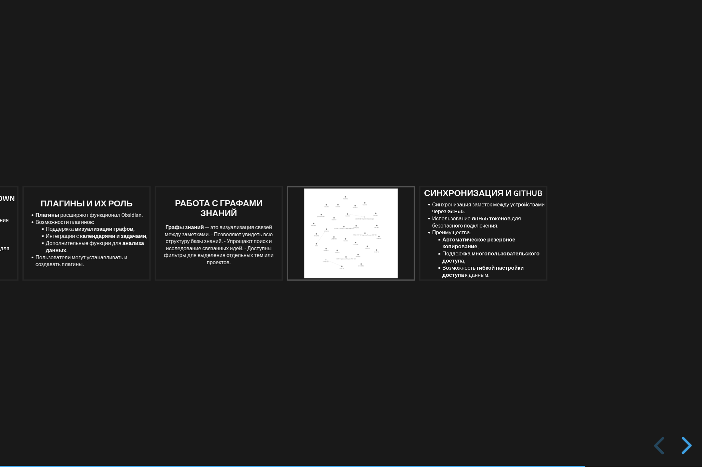

**Слайд 1: Введение в Obsidian**  
Obsidian — это мощный инструмент для работы с заметками, построенный на основе Markdown-файлов. Его ключевая особенность — поддержка ссылок между заметками, что позволяет формировать связи и структуру данных, подобно сети. Это делает его удобным инструментом как для личного использования, так и для работы в команде. Особенно полезен Obsidian для тех, кто строит базы знаний, работает с большими объёмами информации или создаёт исследования.

---

**Слайд 2: Преимущества Markdown в Obsidian**  
Markdown — это лёгкий язык разметки, который позволяет создавать отформатированные заметки с минимальным количеством символов. Простой синтаксис Markdown обеспечивает удобное и быстрое форматирование текста. Благодаря тому, что Markdown является общепринятым форматом, заметки можно легко переносить между разными платформами. Этот формат также способствует долговечности данных, так как заметки остаются доступными вне зависимости от выбранного приложения.

---

**Слайд 3: Плагины и их роль**  
Обсидиан поддерживает установку плагинов, что позволяет расширять его функционал. Существует множество полезных плагинов: от визуализации связей между заметками до интеграций с календарями и задачами. Некоторые плагины позволяют анализировать информацию и автоматизировать процесс её обработки. Система плагинов открывает возможности для кастомизации и подстраивания приложения под индивидуальные потребности пользователя, делая его более гибким и функциональным.

### презентация сделанная в плагине `Advanced slides` по теме этой работы:

сама презентация:
[presentation](presentation.md)

---

**Слайд 4: Работа с графами знаний**  
В Obsidian граф знаний отображает связи между заметками в виде узлов и линий, создавая карту взаимосвязей. Эта визуализация помогает лучше понять, как связаны идеи и темы в вашей базе знаний. Например, вы можете увидеть, как отдельные заметки пересекаются в конкретной теме или проекте. Это упрощает процесс поиска и исследования связанных идей, делая работу более наглядной. С помощью фильтров можно выделить отдельные темы, чтобы сконцентрироваться на изучении конкретного аспекта или проекта.

---

**Слайд 5: Синхронизация и GitHub**  
Obsidian поддерживает синхронизацию заметок через интеграцию с GitHub. Использование GitHub токенов позволяет безопасно подключить учетную запись для автоматического резервного копирования и синхронизации данных между устройствами. Это полезно для тех, кто работает с несколькими устройствами или нуждается в командной работе. Синхронизация через GitHub также позволяет гибко управлять доступом и версионностью данных, предоставляя как общие, так и приватные репозитории для хранения информации.

[подробная инструкция](https://habr.com/ru/articles/843288/)