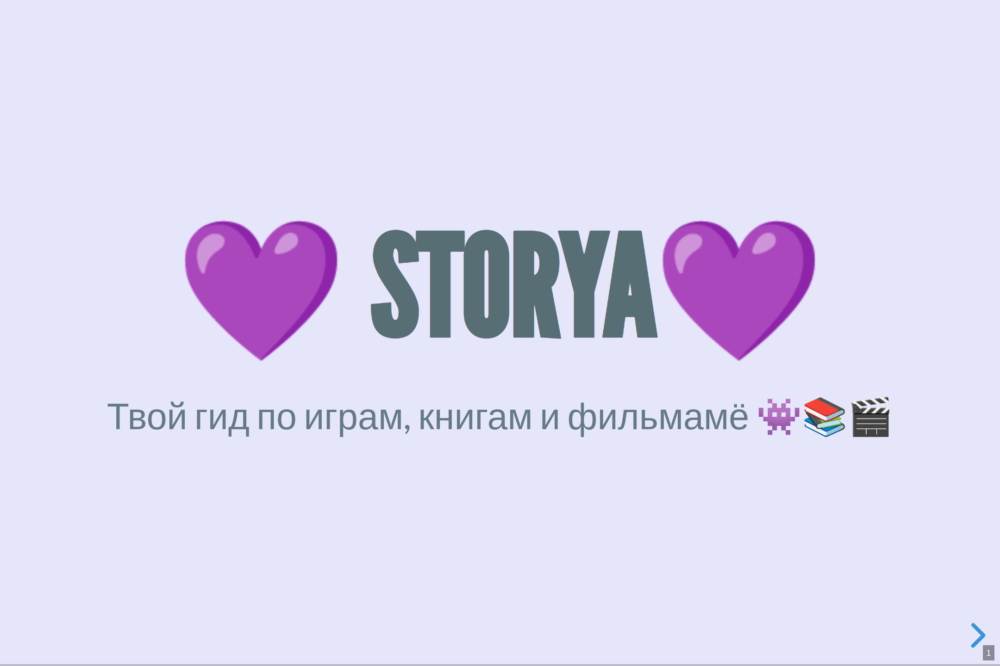
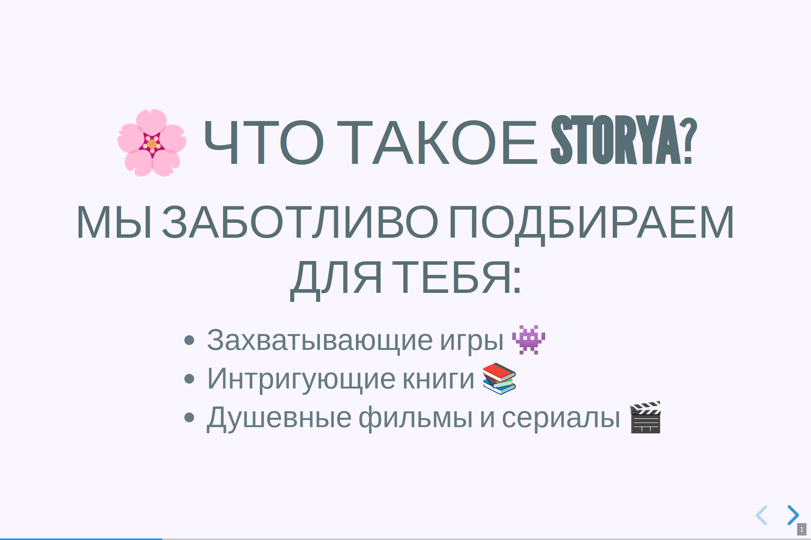
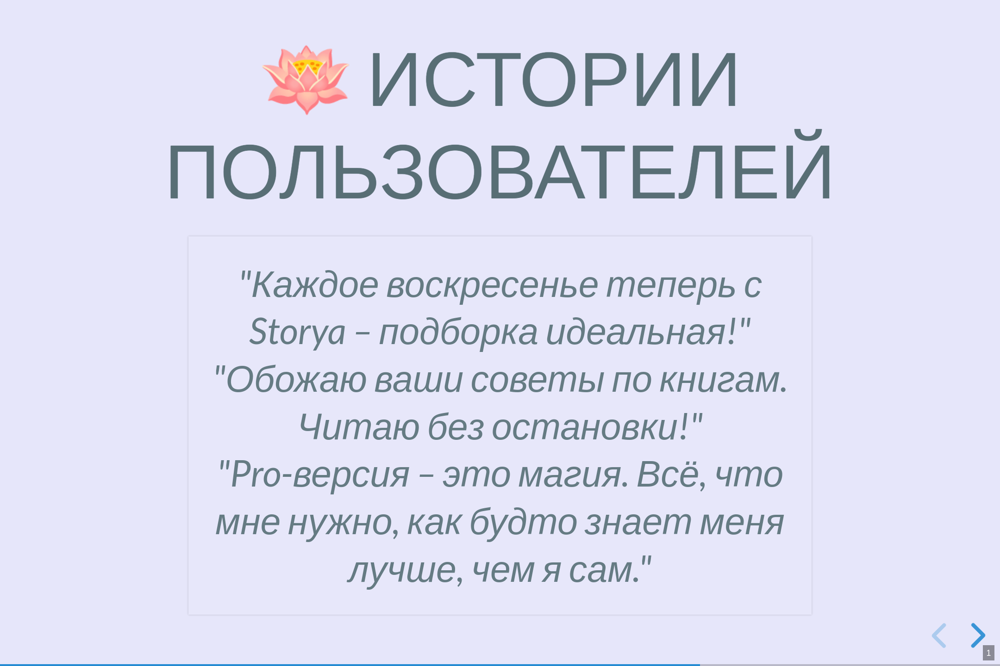
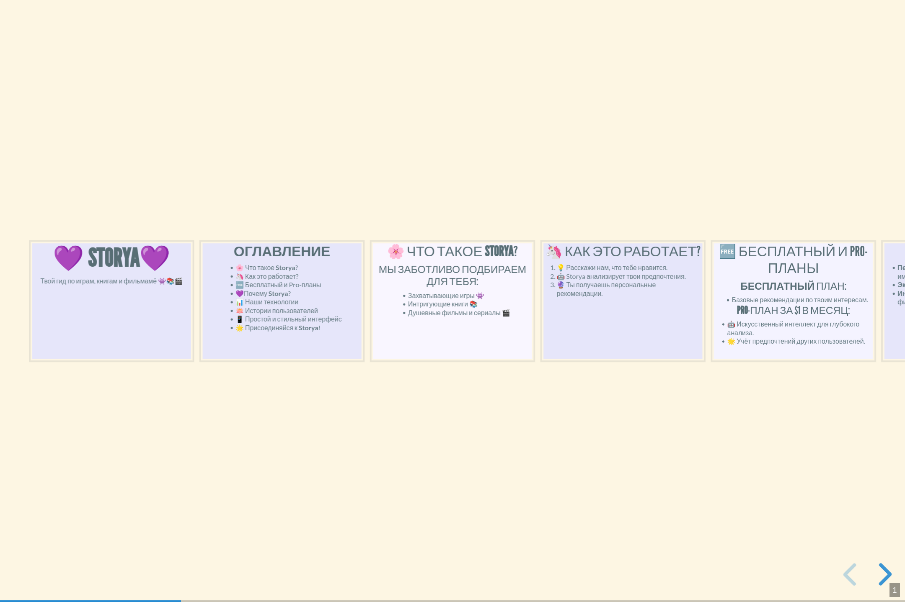

- лого - 
- шаблон - [template](template.md)
- презентация - [presentation](presentation.md)
- текст для презентаци - [text](text.md)

некоторые скриншоты из презентации(чтобы не запускать через obsidian):

