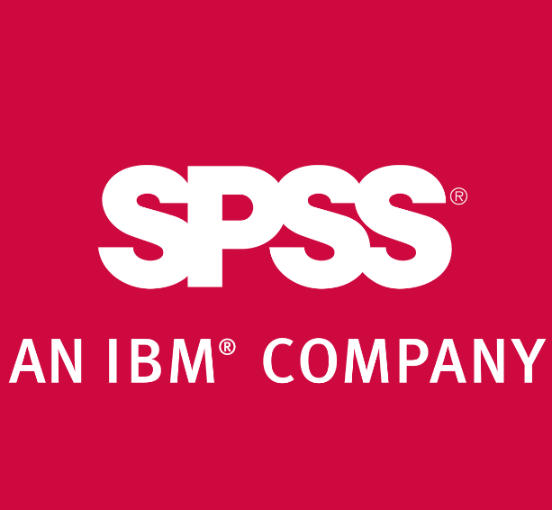

исходный текст находится в файле: [text](text.md)

| №  | Программа                         | Цена                     | 1. Внешние таблицы                                             | 2. Загрузка/выгрузка данных                                   | 3. Построение графиков и диаграмм                            | 4. Числовые характеристики и статистика                     | 5. Лого              |
|----|------------------------------------|--------------------------|-------------------------------------------------------------|------------------------------------------------------------|-----------------------------------------------------------|-----------------------------------------------------------|-------------------|
| 1  | **Microsoft Excel**                | Платная                  | Поддержка CSV, XLS, XLSX, ODS и др.                          | Легкая интеграция с базами данных и API через Power Query   | Широкий набор диаграмм                                     | Описательная статистика, корреляции, регрессии            |  |
| 2  | **Google Sheets**                  | Бесплатная               | Поддержка CSV, XLSX. Импорт из облачных сервисов             | API для выгрузки данных, интеграция с Google Drive          | Интуитивные графики, сводные таблицы                       | Основные статистические функции                           |  |
| 3  | **KNIME**                          | Бесплатная               | Поддержка CSV, Excel, HDF5, ARFF и др.                       | Подключение к базам данных через JDBC, API                  | Визуализация через узлы, интеграция с R и Python           | Машинное обучение, обработка больших данных                |  |
| 4  | **SPSS**                           | Платная                  | Поддержка SPSS, Excel, CSV, SQL                              | Интеграция с SQL базами данных                              | Профессиональные диаграммы                                 | Все виды статистического анализа                          |  |
| 5  | **RStudio**                        | Бесплатная               | Поддержка CSV, Excel, RDS и др.                              | Загрузка данных через API, интеграция с базами данных       | Визуализация через ggplot2 и др. пакеты                    | Полный спектр статистических методов                      |  |
| 6  | **Tableau**                        | Платная/Бесплатная        | Интеграция с различными форматами файлов и баз данных        | Интеграция с множеством источников данных, включая SQL      | Интерактивные визуализации                                 | Основные статистические функции                           |  |
| 7  | **SAS**                            | Платная                  | Поддержка CSV, Excel и др.                                   | Прямая интеграция с базами данных через SQL                 | Расширенные визуализации                                   | Полный спектр профессиональных методов                    |  |
| 8  | **Python (Pandas, NumPy, Matplotlib)** | Бесплатная             | Поддержка CSV, Excel, JSON, SQL                              | Прямой доступ к API, базам данных                           | Визуализация через Matplotlib, Seaborn                     | Мощные библиотеки для работы с данными                    |  |
| 9  | **MATLAB**                         | Платная                  | Поддержка CSV, Excel, HDF5 и др.                             | Интеграция с базами данных                                  | Графические возможности для научных расчетов              | Специализированные математические и статистические функции|  |
| 10 | **Apache OpenOffice Calc**          | Бесплатная               | Поддержка CSV, XLS, ODS                                      | Ограниченные возможности работы с базами данных            | Основные графики и диаграммы                               | Стандартные статистические функции                        |  |
| 11 | **Zoho Sheet**                     | Бесплатная               | Поддержка CSV, XLSX                                          | Интеграция с облаком и Google Drive                         | Основные виды графиков и диаграмм                          | Базовые функции для расчета статистики                    |  |
| 12 | **Qlik Sense**                     | Платная/Бесплатная        | Поддержка множества источников данных                        | Интеграция с внешними базами данных                         | Интерактивные визуализации                                 | Расширенные возможности анализа данных                    |  |
| 13 | **LibreOffice Calc**               | Бесплатная               | Поддержка CSV, XLS, ODS                                      | Похожие возможности на OpenOffice                           | Базовые функции визуализации данных                       | Базовые статистические функции                            |  |
| 14 | **JMP**                            | Платная                  | Поддержка Excel, CSV, SQL                                    | Интеграция с SQL базами данных                              | Продвинутые визуализации и интерактивные графики           | Полный набор статистических методов                       |  |
| 15 | **Domo**                           | Платная                  | Поддержка множества внешних источников данных                | Легкая интеграция с API и базами данных                     | Интерактивные и профессиональные диаграммы                 | Поддержка основных статистических функций                 |  |
| 16 | **TIBCO Statistica**               | Платная                  | Поддержка Excel, CSV и баз данных                            | Интеграция с SQL, облачными источниками                     | Продвинутые возможности визуализации                      | Расширенные функции анализа, машинное обучение            |  |
| 17 | **Minitab**                        | Платная                  | Поддержка CSV, Excel и текстовых файлов                      | Интеграция с базами данных, поддержка больших данных        | Профессиональные графики для анализа                      | Полный набор статистических инструментов                  |  |
| 18 | **Stata**                          | Платная                  | Поддержка CSV, Excel, базы данных                            | Интеграция с SQL и работа с большими объемами данных        | Расширенные возможности построения диаграмм               | Все основные статистические функции                       |  |
| 19 | **Orange**                         | Бесплатная               | Поддержка CSV, Excel, SQL                                    | Интеграция с различными источниками данных                  | Интерактивные и сложные визуализации                      | Машинное обучение, расширенный статистический анализ      |  |
| 20 | **RapidMiner**                     | Платная/Бесплатная        | Поддержка CSV, Excel, базы данных                            | Подключение к базам данных и внешним источникам             | Расширенные возможности визуализации                      | Все виды статистического анализа и машинного обучения     |  |
