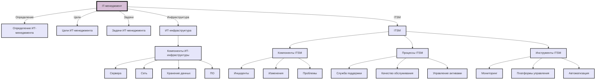

Отчет 1.3  
ФИО: Суворов Роман

## 1. Основные понятия, цели и задачи IT-менеджмента

### 1.1 Определение, составные части и основные требования к ИТ-инфраструктуре

**ИТ-инфраструктура** — это совокупность всех аппаратных и программных средств, сетей и сервисов, необходимых для функционирования и управления информационными технологиями в организации. Она включает в себя серверы, системы хранения данных, операционные системы, базы данных, сетевое оборудование и программное обеспечение.

Составные части ИТ-инфраструктуры:

- **Аппаратные средства** (серверы, рабочие станции, периферийные устройства).
- **Программное обеспечение** (операционные системы, системы управления базами данных).
- **Сетевые ресурсы** (локальные и глобальные сети, интернет-подключения).
- **Хранилища данных** (базы данных, системы хранения).
- **Сервисы и приложения** (почтовые, веб, системы управления и мониторинга).

Основные требования к ИТ-инфраструктуре:

- Надежность и доступность систем.
- Масштабируемость для адаптации к растущим потребностям бизнеса.
- Безопасность данных и системы от внешних угроз.
- Совместимость компонентов системы.
- Экономическая эффективность и поддержка требований бизнеса.

### 1.2 Суть концепции ITSM

**ITSM (IT Service Management)** — это набор процессов и инструментов, которые используются для проектирования, предоставления, управления и поддержки ИТ-услуг, ориентированных на потребности бизнеса. ITSM включает в себя стандарты и лучшие практики для обеспечения качества и эффективности ИТ-услуг.

Основные принципы ITSM:

- Ориентация на услуги: все действия ИТ-подразделений направлены на предоставление качественных услуг для пользователей.
- Процессный подход: управление ИТ-услугами осуществляется на основе процессов, что помогает автоматизировать и улучшать работу.
- Постоянное улучшение: использование подходов, направленных на повышение качества и эффективности предоставляемых услуг.

Наиболее распространенным стандартом для ITSM является ITIL (Information Technology Infrastructure Library), который описывает детализированные процессы по управлению ИТ-услугами.

