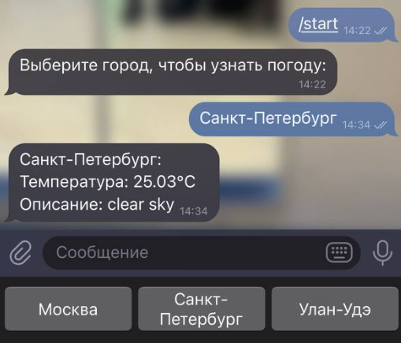

# Создание / публикация своего пакета
## Выполнил Суворов Роман
##### прог5 лр2.2


---
## команды публикации пакета / модуля:

```bash
git init
git commit -m "Initial commit"
git remote add origin https://github.com/ВАШ_ПОЛЬЗОВАТЕЛЬ/github-репозиторий.git
git push -u origin master
```

---
## команды получения пакета / модуля:
```bash
go get github.com/{ИМЯ_ПОЛЬЗОВАТЕЛЯ/GIT_РЕПОЗИТОРИЙ}
```

---



---
# Спасибо за внимание


