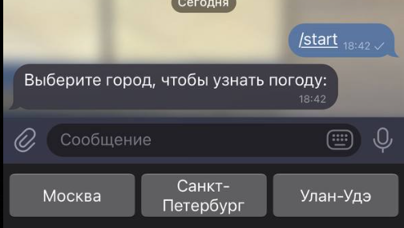
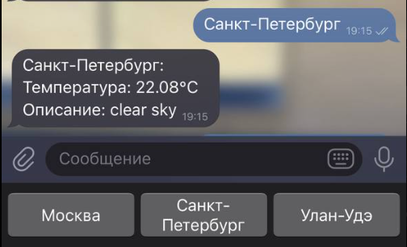

# Суворов Роман ИВТ 2.1

## Прог5 Лабораторная работа №2

### [Ссылка на код](https://github.com/webbsalad/go-weather-bot)

_(TELEGRAM_BOT_API_TOKEN и OPENWEATHERMAP_API_KEY хранятся в файле .env)_

### Описание проекта

Данный код запускает Telegram-бота для получения погодной информации. После запуска бота пользователю предлагается три кнопки на выбор:




При нажатии на одну из кнопок формируется URL для запроса к API OpenWeatherMap:
```go
url := fmt.Sprintf("http://api.openweathermap.org/data/2.5/weather?q=%s&appid=%s", cityName, apiKey)

resp, err := http.Get(url)
```

Запрос возвращает JSON-ответ следующего вида:
```json
{
  "coord": {
    "lon": 30.2642,
    "lat": 59.8944
  },
  "weather": [
    {
      "id": 800,
      "main": "Clear",
      "description": "clear sky",
      "icon": "01d"
    }
  ],
  "base": "stations",
  "main": {
    "temp": 294.23,
    "feels_like": 293.86,
    "temp_min": 294.23,
    "temp_max": 294.23,
    "pressure": 1024,
    "humidity": 56,
    "sea_level": 1024,
    "grnd_level": 1021
  },
  "visibility": 10000,
  "wind": {
    "speed": 2,
    "deg": 170
  },
  "clouds": {
    "all": 0
  },
  "dt": 1725812234,
  "sys": {
    "type": 1,
    "id": 8926,
    "country": "RU",
    "sunrise": 1725765078,
    "sunset": 1725813731
  },
  "timezone": 10800,
  "id": 498817,
  "name": "Saint Petersburg",
  "cod": 200
}
```

Из выделяется основная информация о погоде и производится перевод градусов кельвина в цельсия с помощью:
```go
response := fmt.Sprintf("%s:\nТемпература: %.2f°C\nОписание: %s", city, weatherData.Main.Temp-273.15, weatherData.Weather[0].Description)
```

Отформатированная информация:
```text
Температура: 22.08°C, Описание: clear sky
```

После обработки данных сообщение с информацией о погоде отправляется пользователю в Telegram:



