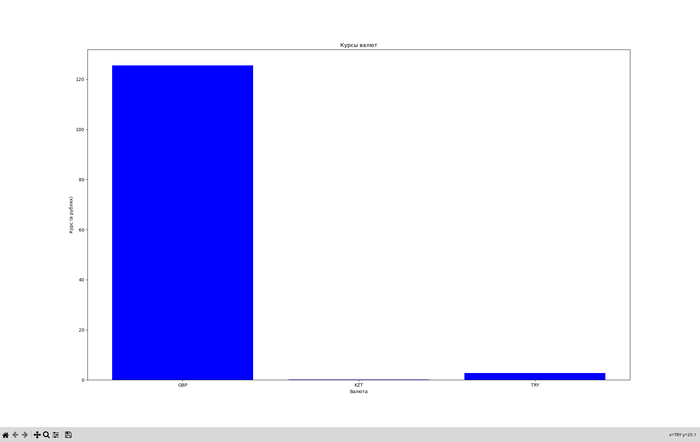
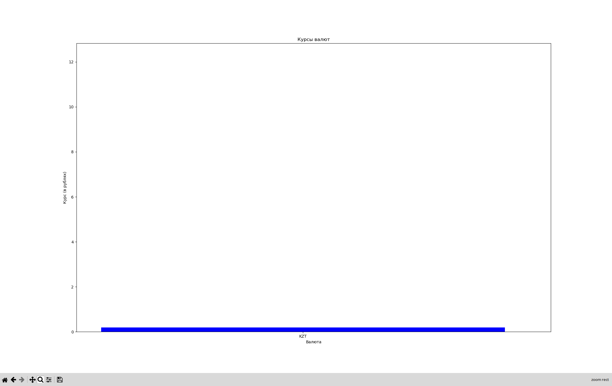

# Суворов Роман ИВТ 2.1

## Прог5 Лабораторная работа №5

### Описание проекта

Код реализует шаблон проектирования "одиночка" для получения данных о курсах валют с сайта ЦБ РФ. Использован метакласс для предотвращения создания более одного экземпляра класса `CurrencyFetcher`.

Пример работы с классом:
```python
fetcher = CurrencyFetcher()
result = fetcher.get_currencies(['R01035', 'R01335', 'R01700J'])

```

Метод `get_currencies` возвращает список валют с указанием курса:
```json
[{'GBP': ('Фунт стерлингов Соединенного королевства', '113.2069')}, 
 {'KZT': ('Казахстанских тенге', '19.8264')}, 
 {'TRY': ('Турецких лир', '33.1224')}]

```

Также реализована функция визуализации данных:


(приближенное поле тенге):
