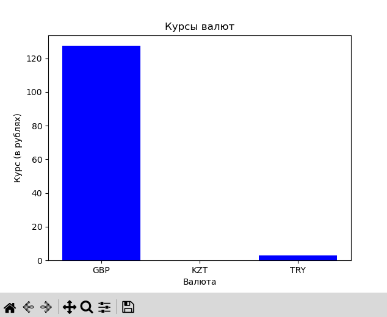

# Суворов Роман ИВТ 2.1

## Прог5 Лабораторная работа №5

Код реализует шаблон проектирования "Декоратор" для получения данных о курсах валют с сайта Центробанка Российской Федерации. Основная идея заключается в том, чтобы создать базовый класс `CurrenciesList`, который предоставляет функционал для получения информации о валютах, и расширять его с помощью декораторов для получения данных в различных форматах.

Основная функциональность включает:

1. Получение курсов валют в формате словаря.
2. Визуализацию данных с помощью графиков.
3. Поддержка форматов вывода данных JSON и CSV через декораторы.

Пример работы с классом:
```python
fetcher = CurrenciesList()
result = fetcher.get_currencies(['R01035', 'R01335', 'R01700J'])

```

Метод `get_currencies` возвращает список валют с указанием курса в виде словаря:
```json
[{'GBP': {'name': 'Фунт стерлингов Соединенного королевства', 'value': '113.2069'}}, 
 {'KZT': {'name': 'Казахстанских тенге', 'value': '19.8264'}}, 
 {'TRY': {'name': 'Турецких лир', 'value': '33.1224'}}]

```

(после преобразования):
```json
[
    {
        "GBP": {
            "name": "Фунт стерлингов Соединенного королевства",
            "value": "127.3481"
        }
    },
    {
        "KZT": {
            "name": "Казахстанских тенге",
            "value": "0.1995"
        }
    },
    {
        "TRY": {
            "name": "Турецких лир",
            "value": "2.8411"
        }
    }
]
```


### Использование декораторов

Код включает два декоратора:

- **ConcreteDecoratorJSON**: преобразует полученные данные в формат JSON.
- **ConcreteDecoratorCSV**: преобразует полученные данные в формат CSV.

Примеры использования декораторов:
```python
json_decorator = ConcreteDecoratorJSON(fetcher)
result_json = json_decorator.get_currencies(['R01035', 'R01335', 'R01700J'])
print(result_json)

csv_decorator = ConcreteDecoratorCSV(fetcher)
result_csv = csv_decorator.get_currencies(['R01035', 'R01335', 'R01700J'])
print(result_csv)

```


вывод:
