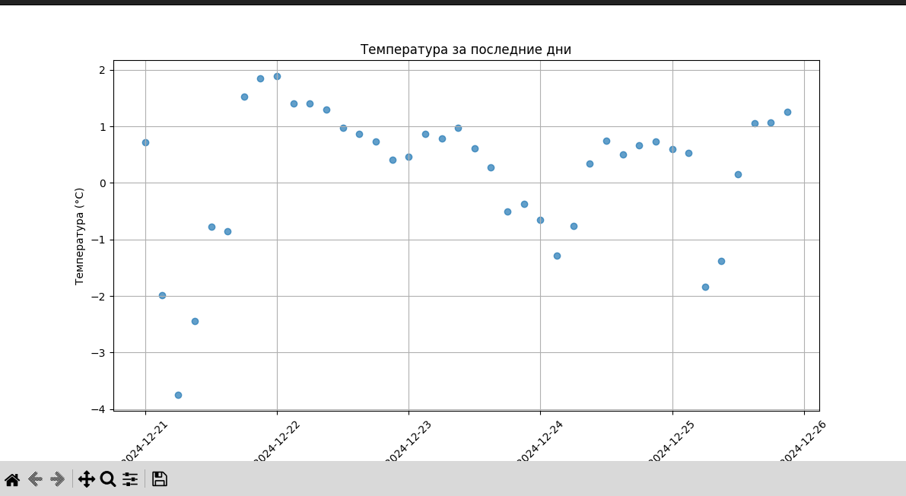
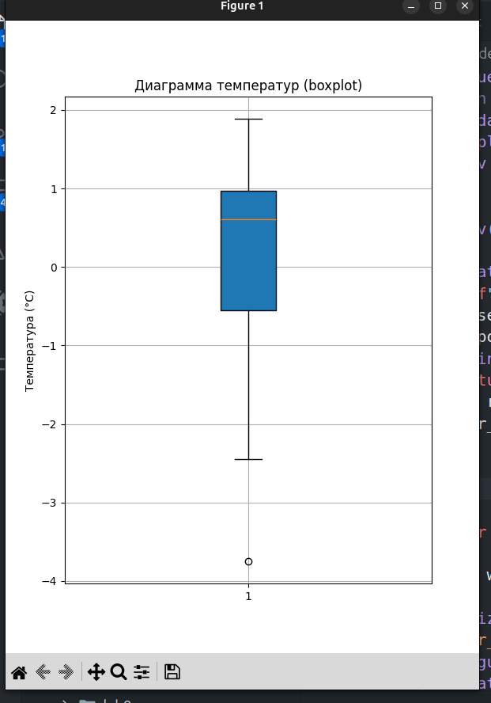
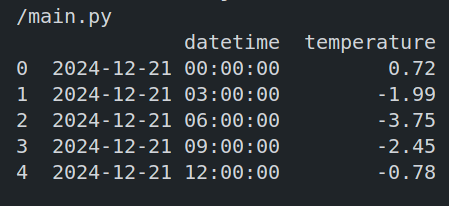

# Суворов Роман ИВТ 2.1  
## Прог Лабораторная работа №8  

### Описание  

Код реализует программу для получения и визуализации данных о погоде с использованием API OpenWeatherMap. Программа запрашивает данные о погоде за последние 5 дней для заданных координат и визуализирует их в виде диаграммы рассеяния (scatterplot) и диаграммы "ящик с усами" (boxplot).  

### Структура программы  

1. **Получение данных**: Используется API OpenWeatherMap для получения данных о погоде в формате JSON. Данные включают температуру, дату и время для заданных координат.  
2. **Визуализация данных**: Построение графиков температуры за последние 5 дней:
   - Диаграмма рассеяния показывает изменение температуры во времени.
   - Диаграмма "ящик с усами" отображает распределение температур за период.  

### Основные функции  

1. **Получение данных о погоде**:  
   - Функция отправляет запрос к OpenWeatherMap с указанными широтой, долготой и API-ключом.  
   - Возвращает данные о температуре и времени.  

2. **Визуализация данных**:  
   - Диаграмма рассеяния (scatterplot) используется для отображения изменений температуры во времени.  
   - Диаграмма "ящик с усами" (boxplot) показывает распределение температур.  

### Пример использования  

1. API-ключ подгружается из файла `.env`.  
2. Программа автоматически получает данные о погоде и строит графики.  

**Пример формата данных из OpenWeatherMap**:  
```json
[
    {
        "datetime": "2024-12-19 12:00:00",
        "temperature": 5.4
    },
    {
        "datetime": "2024-12-19 15:00:00",
        "temperature": 3.7
    }
]
```



