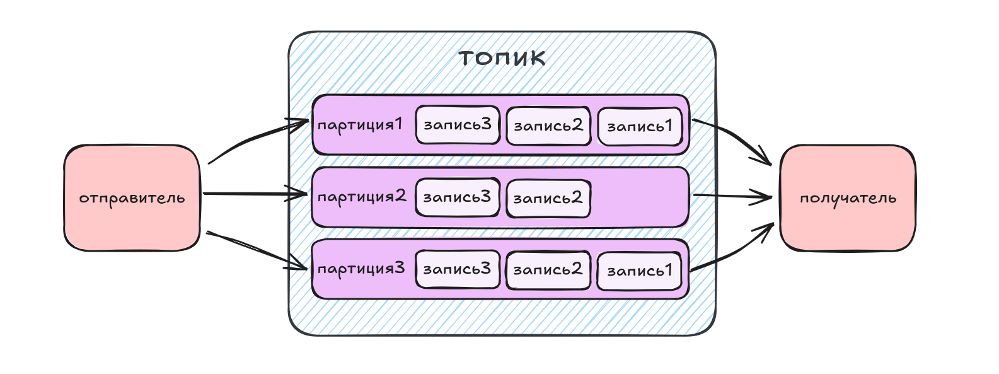

# Авторы:
- ###### developed by:
Суворов Роман, Гневнов Артем, Адаминко  **`С.С.`**

---
## Что такое Apache Kafka?

**Определение:**

Apache Kafka — распределённая платформа для потоковой обработки данных в реальном времени.

**Основные задачи:**

- Передача сообщений между системами
- Хранение данных
- Анализ данных в реальном времени
---
# Схема работы Kafka

---
## Применение Kafka

**Сферы использования:**

- Интеграция микросервисов
- Обработка больших данных
---
## Архитектура Kafka

**Компоненты:**

- Producer
- Broker
- Topic
- Partition
- Consumer
---
**Работа:**

---
# Producer

**Функция:**

Отправляет сообщения в Kafka.

**Особенности:**

- Отправка в разные топики
- JSON, XML, Avro, Protobuf, и даже двоичные данные.
- Порядок в партиции
---
# Broker

**Функция:**

Хранит и доставляет сообщения.

**Особенности:**

- Репликация данных
- Кластер из брокеров
---
## Топики и партиции

**Топик:**

Группа сообщений.

**Партиция:**

- Деление топика
- Параллельная обработка
---
# Consumer

**Функция:**

Читает и обрабатывает данные.

**Особенности:**

- Несколько групп потребителей
- Масштабируемость
---
## Schema Registry

**Функция:**

Хранение схем данных.

**Как работает:**

- Producer регистрирует схему
- Consumer использует схему

**Зачем нужно:**

- Избежать ошибок формата
- Совместимость версий
---
# Работа

---
# Спасибо за внимание 
---

---
# благодарим за внимание, до свидания 