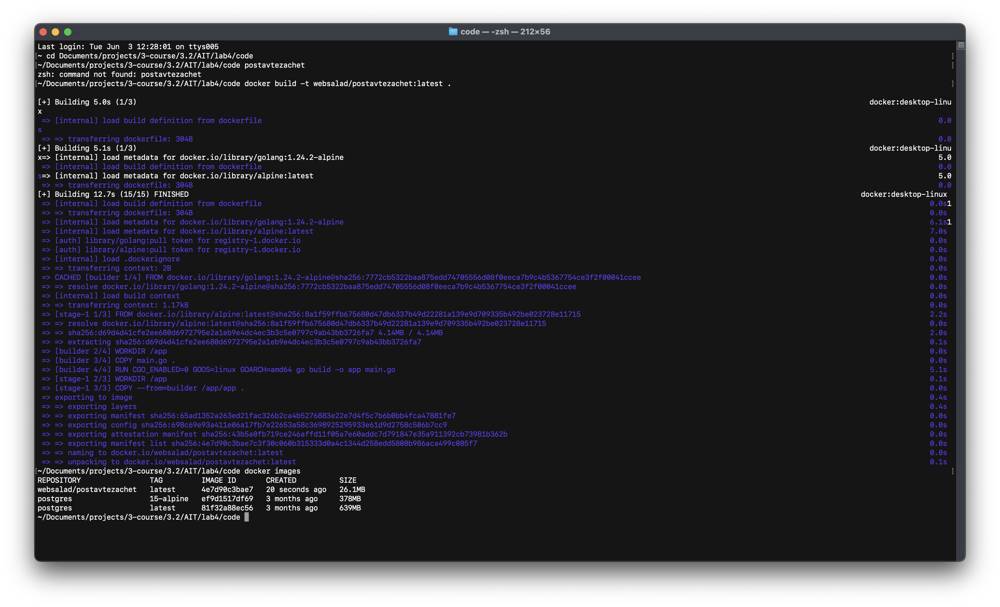
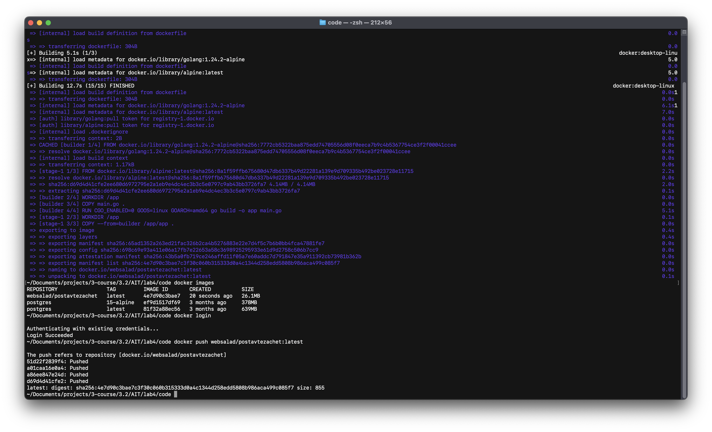
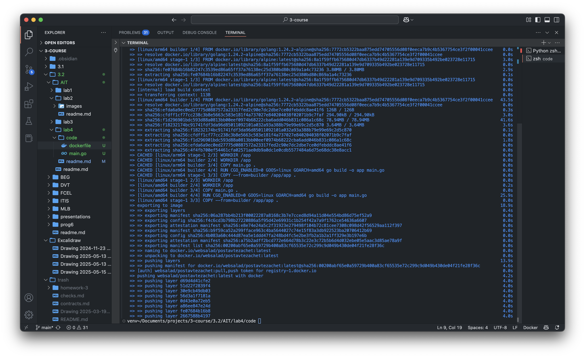
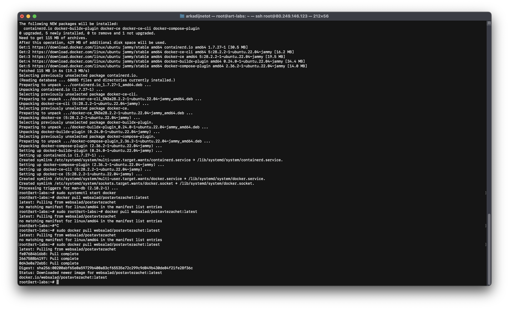
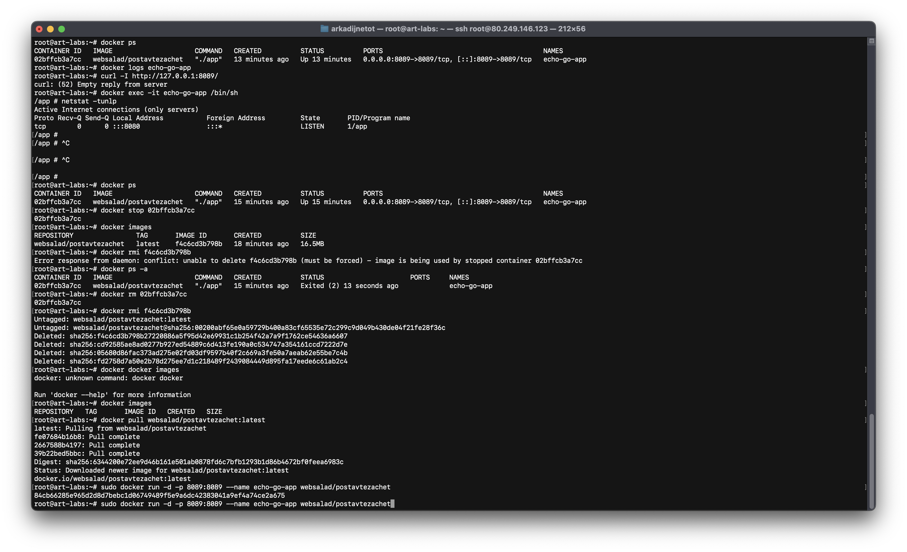
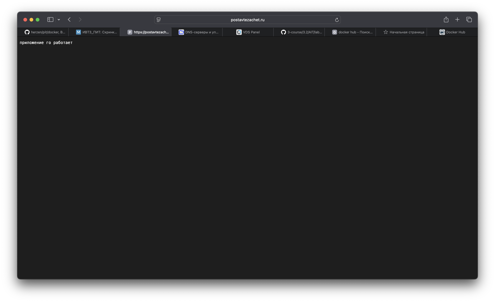
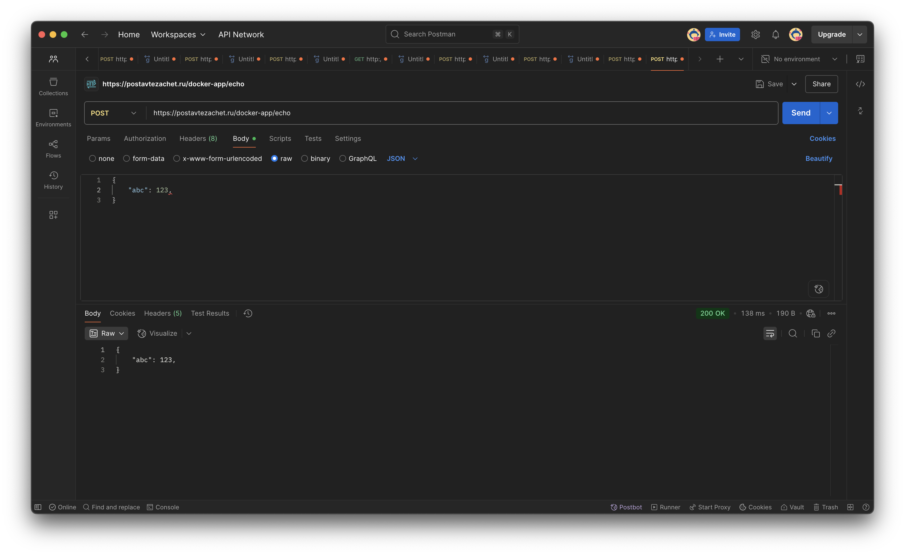

код приложения: [ссылка](code/main.go)

код докерфайла: [ссылка](code/dockerfile)

билдим docker image локально

пушим image на docker hub 

перебилдил и перепушил как latest для amd64)

установка docker и pull image

перенастройка(

запущенное приложение

демонстрация post 
