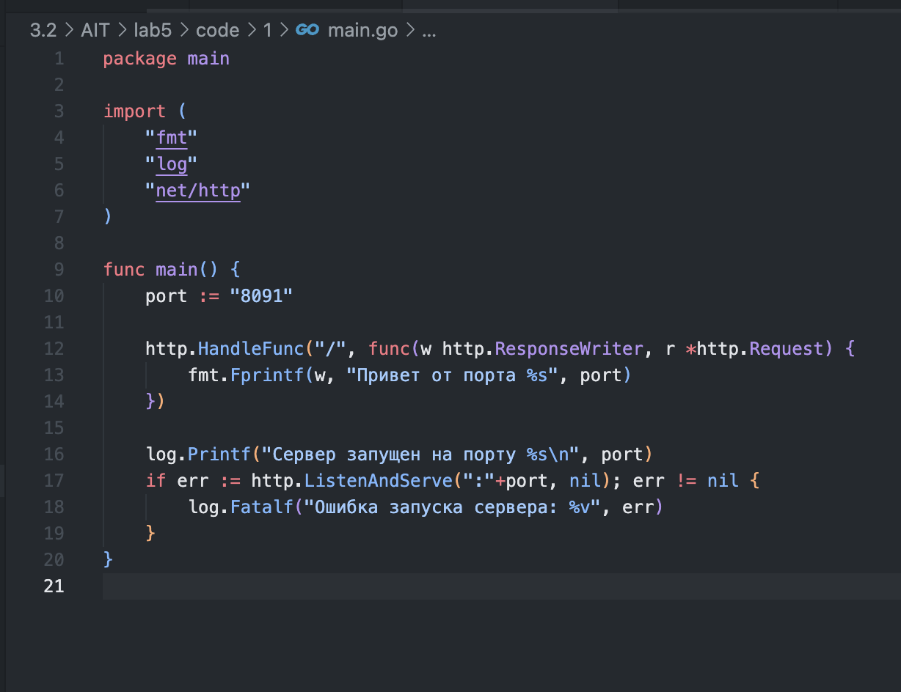
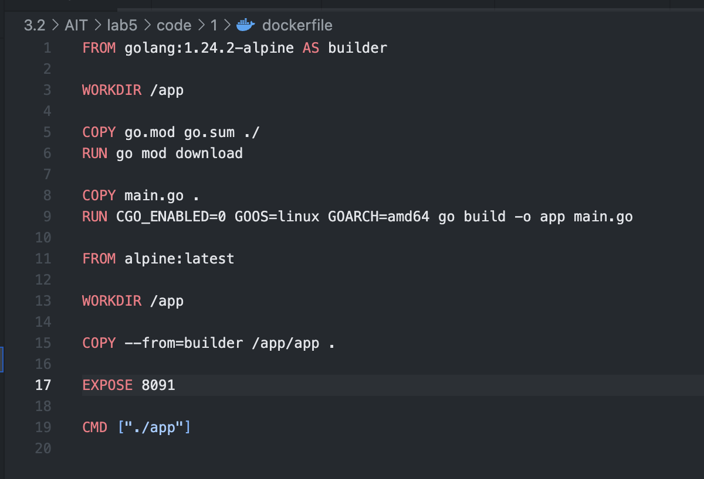
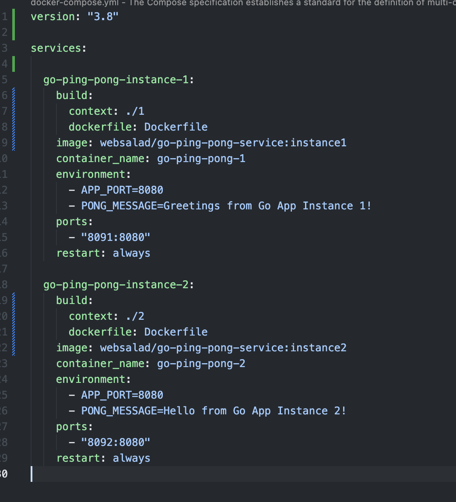
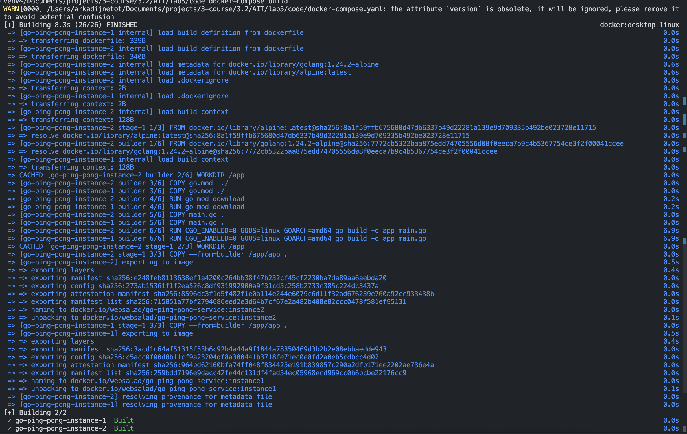
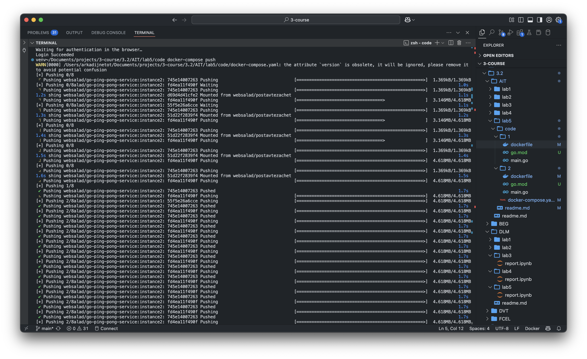
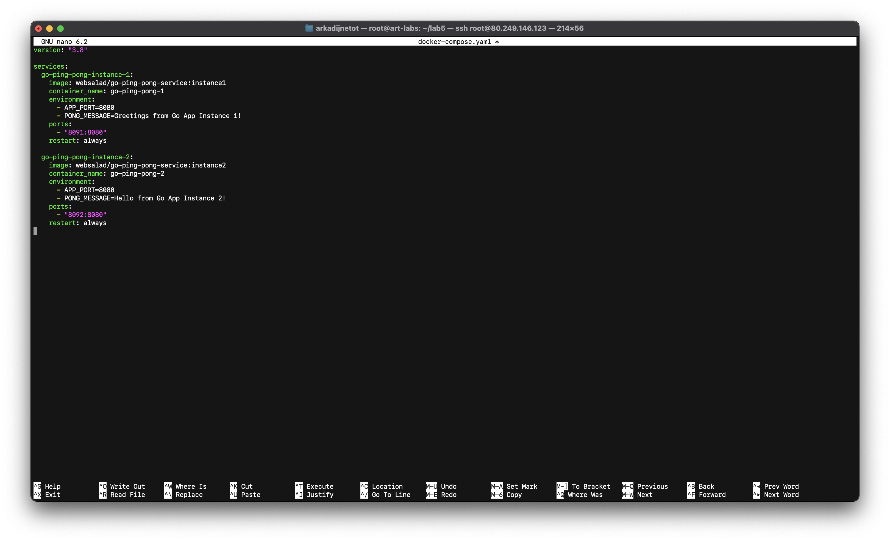
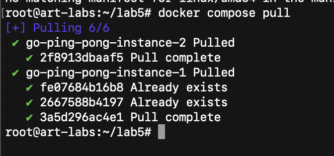
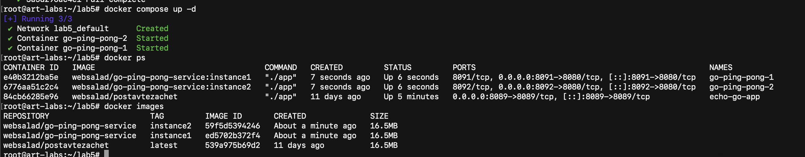
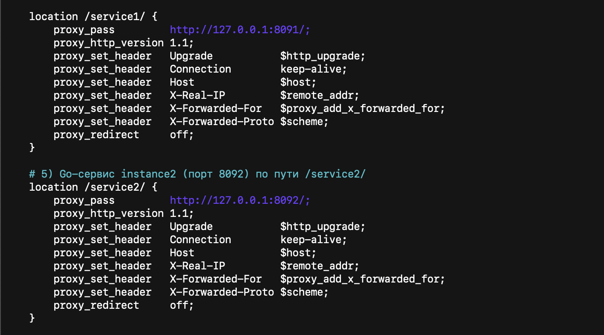
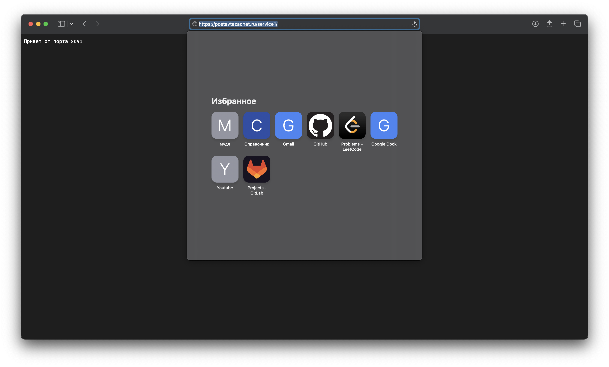

приложения [первое](code/1/main.go) и [второе](code/2/main.go)

dockerfile [первый](code/1/dockerfile) и [второй](code/2/dockerfile)

docker-compose [тык](code/docker-compose.yaml)

билд

пуш

docker compose на сервере

ап на сервере

запуск на сервере

добавляем обработку

ответы от приложения

