начальное создание подключение:
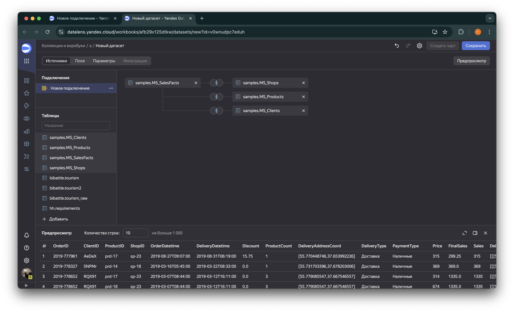
число заказов:
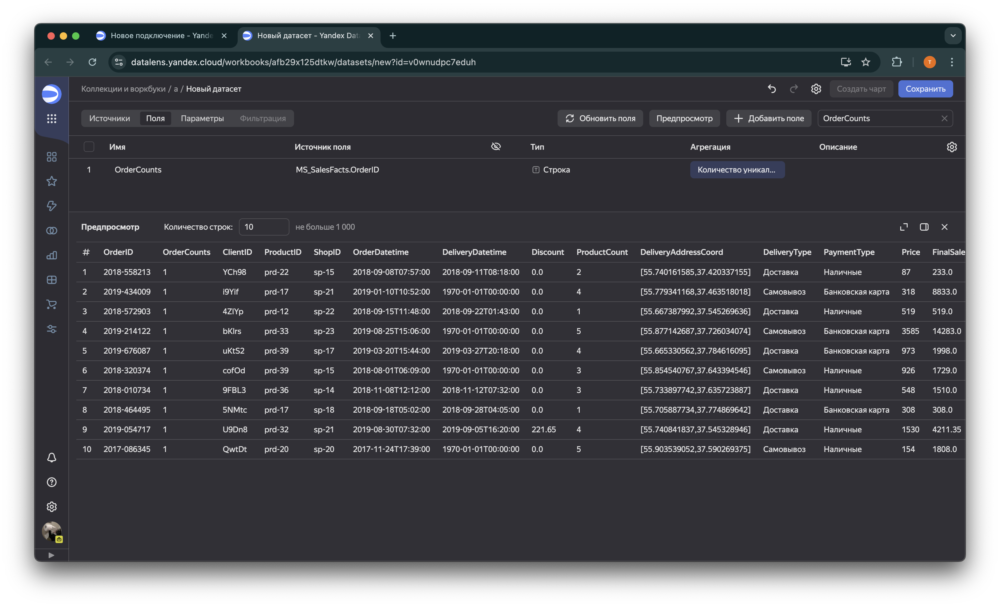
новый датасет:
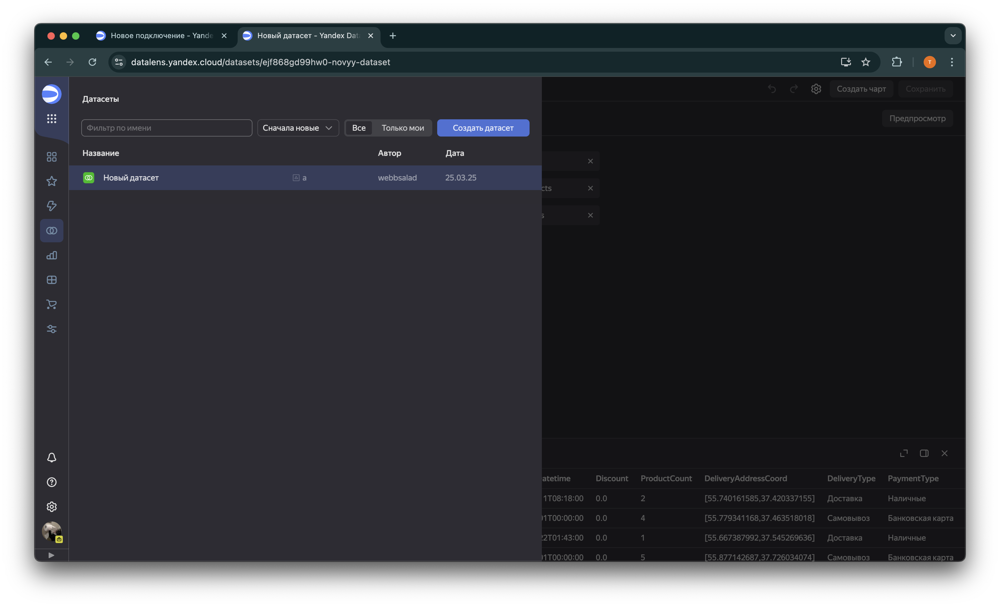

Выручка магазинов по категориям:
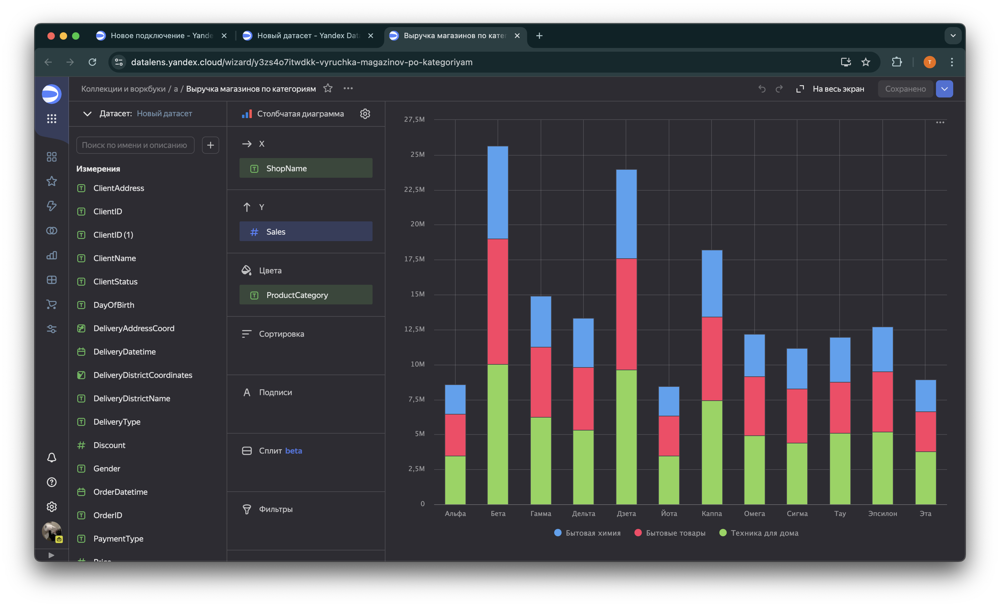

OrderDateTime в x:
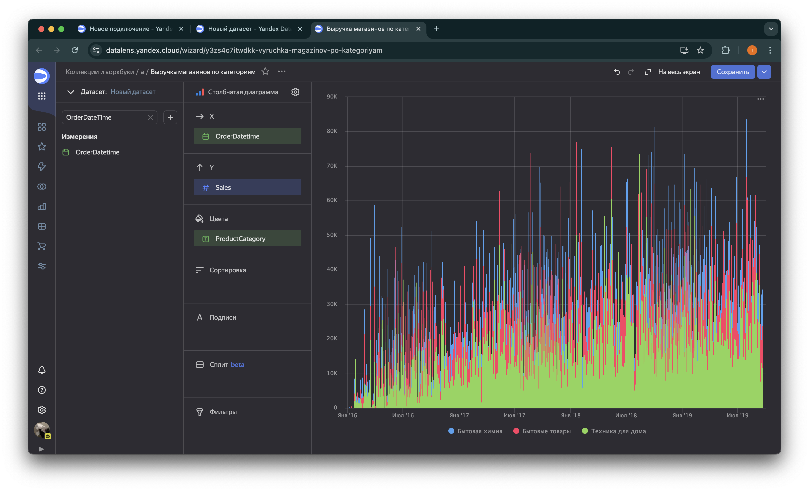

за неделю:
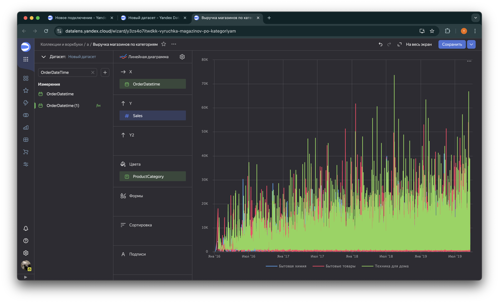

с областями:
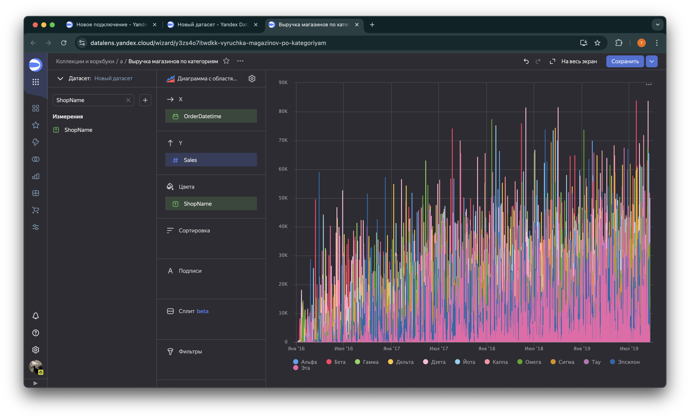
карта с геоточками:
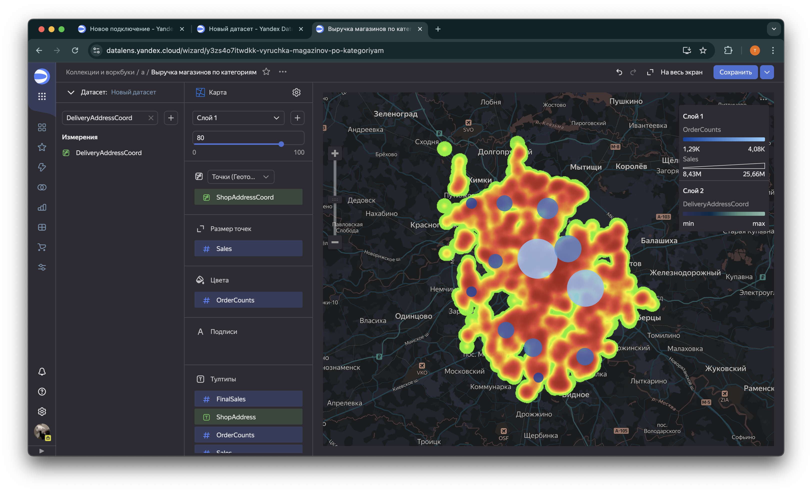

не удалось объединить диаграммы так как функционал сайта был изменен

Доля самовывоза:
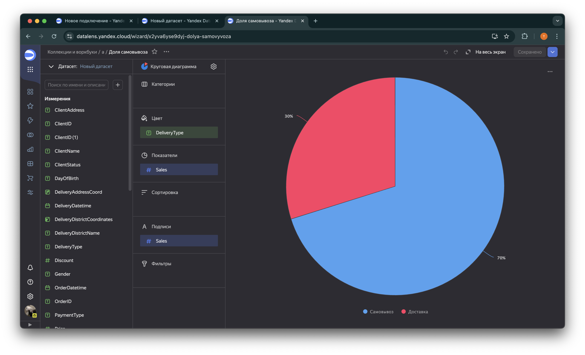

Статус клиента и тип доставки по магазинам
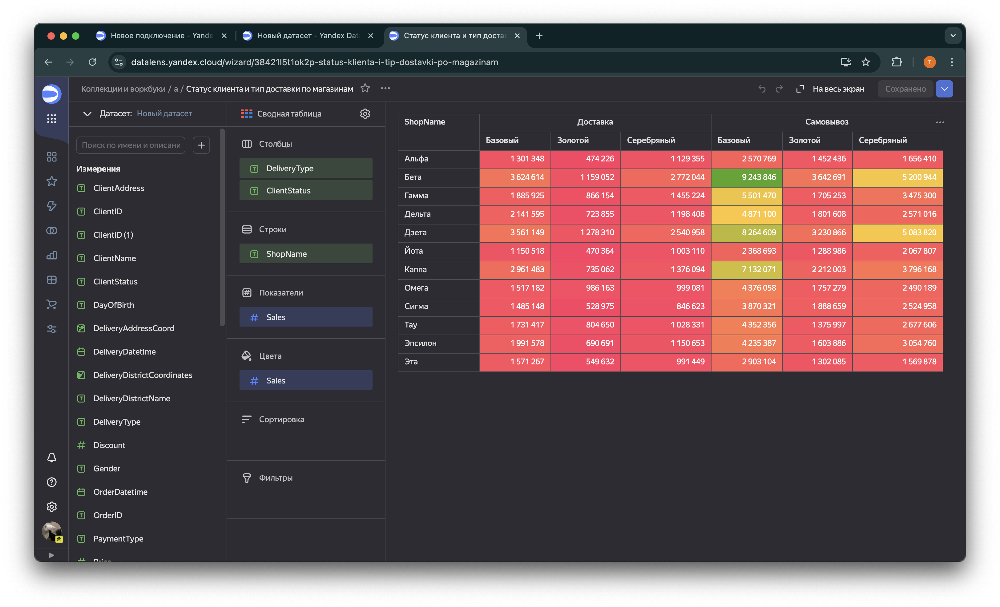

средний чек:
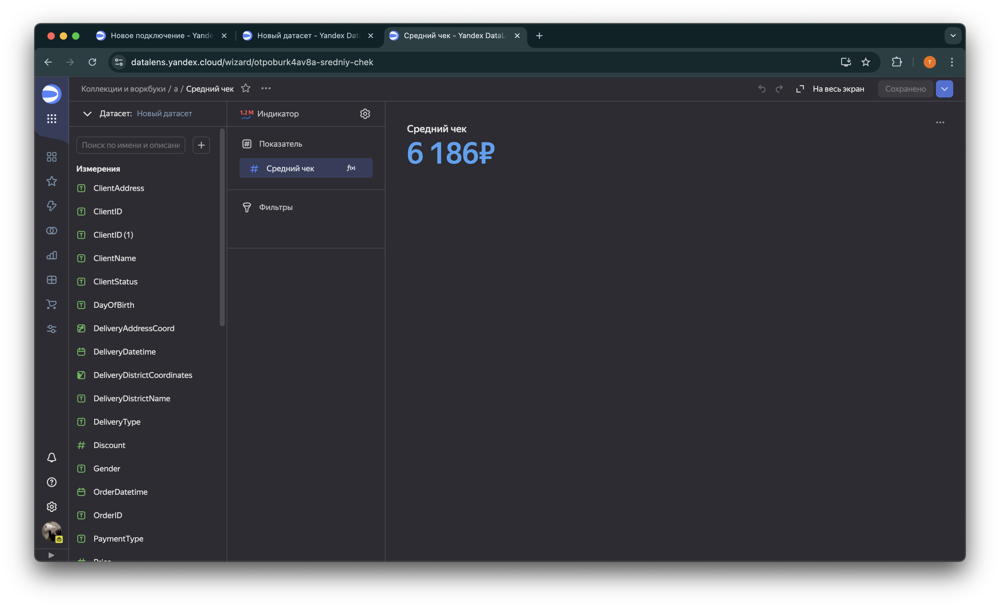

продажи:
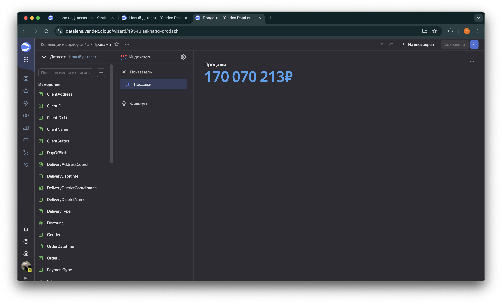

число заказов:
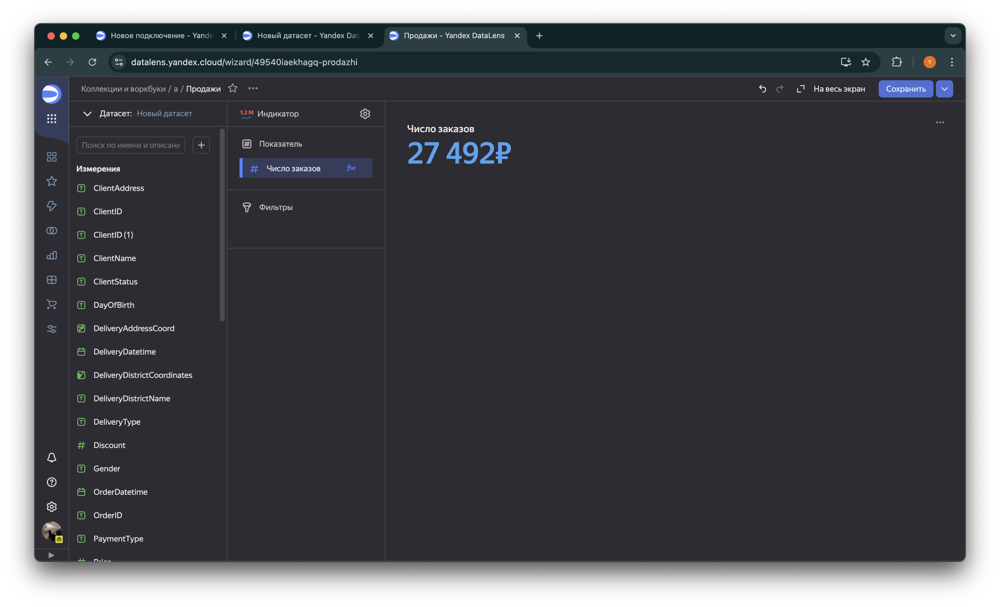

объединить также не получилось 