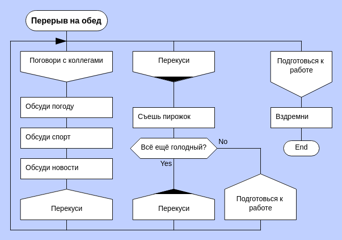
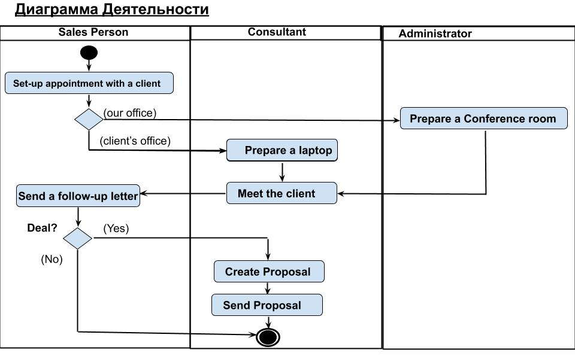
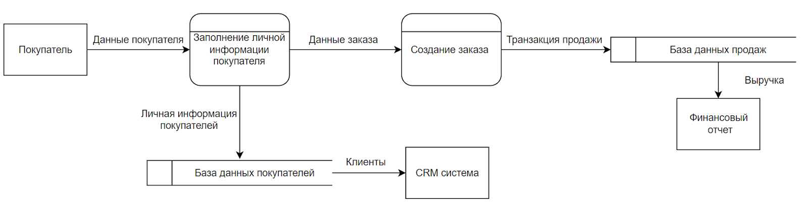
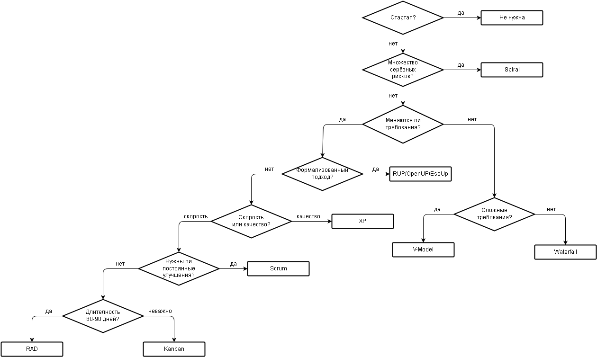
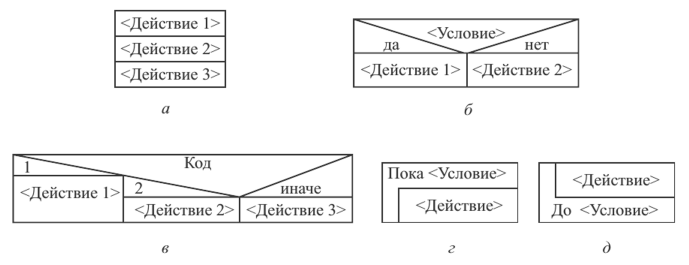

# ИСР 1

---

## Общая информация

В алгоритмизации и программировании используется множество графических способов записи алгоритмов. Они помогают визуализировать логику выполнения, выявлять ошибки на этапе проектирования, а также упрощают понимание и сопровождение программ. В рамках данной работы рассматриваются основные графические формы записи алгоритмов, упомянутые в учебных материалах.

---

## ДРАКОН-схемы

ДРАКОН (Дружелюбный алгоритмический язык, наглядный) — язык визуального описания алгоритмов, созданный для повышения читаемости и простоты восприятия.

### Ключевые характеристики:

- Иерархическая структура блоков.
    
- Логика алгоритма представляется строго сверху вниз.
    
- Минимум визуальных пересечений и разветвлений.
    
- Каждый элемент (ввод, вывод, условие, действие и т.п.) имеет строго определённый символ.
    
- Повышенная читаемость делает язык особенно удобным для междисциплинарных команд и систем критического назначения.
    

Этот способ используется в программировании, управлении проектами, бизнес-моделировании и обучении.

---

## Диаграммы деятельности UML

Диаграммы деятельности UML отображают процессы и алгоритмы, акцентируя внимание на потоках управления и действиях, выполняемых в системе.

### Ключевые характеристики:

- Представляют алгоритм в виде направленного графа с действиями и переходами.
    
- Поддерживают разветвления, циклы, параллельное выполнение.
    
- Используются для описания бизнес-процессов и логики программного обеспечения.
    
- Каждый элемент: действие, решение, начало и конец процесса — оформлен в виде стандартных блоков.
    

Эти диаграммы широко применяются в анализе требований и проектировании программных систем.

---

## Диаграммы потоков данных (DFD)

Диаграммы потоков данных применяются для описания логики обработки и перемещения данных в системе.

### Ключевые характеристики:

- Показывают, как данные поступают, обрабатываются, сохраняются и передаются между различными компонентами.
    
- Используют обозначения: внешние сущности, процессы, хранилища данных и потоки данных.
    
- Не отображают последовательность выполнения, акцент делается именно на данных.
    
- Позволяют наглядно представить архитектуру информационных систем.
    

Подход эффективен при проектировании систем обработки информации, баз данных и пользовательских интерфейсов.

---

## Р-схемы

Р-схема — это одна из традиционных форм алгоритмической записи, близкая по структуре к блок-схемам, но с упором на чёткое разделение структурных элементов.

### Ключевые характеристики:

- Используются простые графические элементы: прямоугольники (действия), ромбы (условия), стрелки (переходы).
    
- Поддерживаются базовые алгоритмические структуры: следование, ветвление, цикл.
    
- Применяются в учебных курсах по информатике и программированию.
    
- Способствуют формированию алгоритмического мышления и пониманию базовых конструкций.
    

---

## Диаграммы Нэсси-Шнейдермана

Диаграммы Нэсси–Шнейдермана, также называемые структурограммами, представляют алгоритмы без стрелок, через вложенные блоки.

### Ключевые характеристики:

- Каждый блок представляет действие, условие или цикл.
    
- Вложенность блоков отражает логическую структуру алгоритма.
    
- Отсутствие линий-переходов делает диаграмму компактной и легко читаемой.
    
- Подход особенно эффективен для начального обучения программированию.
    

Этот тип диаграмм активно используется в образовательной практике, а также в визуальных языках программирования (например, Scratch или Blockly).

---

## Заключение

Каждая из рассмотренных графических форм обладает своими преимуществами в зависимости от цели использования. ДРАКОН-схемы отличаются простотой и дисциплинированностью, UML подойдёт для сложных процессов с параллельным выполнением, DFD удобно использовать для анализа обработки данных, Р-схемы полезны при обучении, а диаграммы Нэсси-Шнейдермана — для визуальной демонстрации структурного программирования. Все эти формы находят применение в различных сферах программной инженерии и образовательной деятельности.