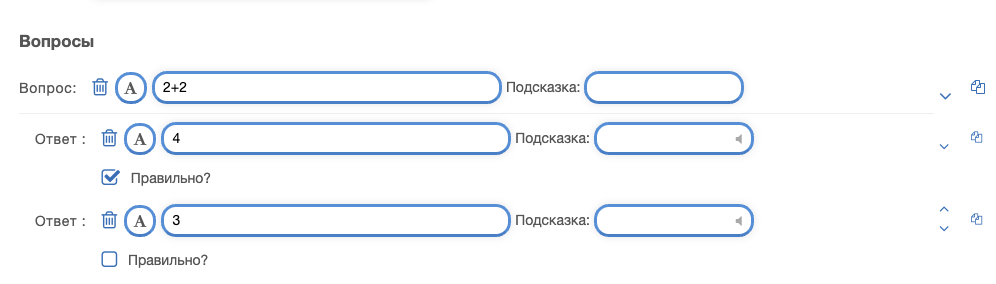

### **SCORM: Определение, Преимущества и Инструменты**

#### **1. Определение SCORM**

SCORM (_Sharable Content Object Reference Model_) — это модель для создания и распространения электронных учебных материалов, обеспечивающая их совместимость с системами управления обучением (LMS, Learning Management System). SCORM определяет стандарты упаковки, взаимодействия и отслеживания учебного контента, что делает его универсальным для различных платформ.

#### **2. Преимущества ресурсов, выполненных в стандарте SCORM**

Ресурсы, созданные по стандарту SCORM, обладают рядом преимуществ:

- **Совместимость** — контент можно использовать в разных LMS, поддерживающих SCORM.
- **Модульность** — можно легко комбинировать различные SCORM-модули для построения курса.
- **Отслеживание прогресса** — позволяет фиксировать, какие части курса пользователь прошел, его оценки, время прохождения и другие данные.
- **Гибкость обновления** — изменения в SCORM-ресурсах можно вносить без необходимости менять всю LMS.
- **Интерактивность** — поддерживает различные мультимедийные элементы (видео, анимация, тесты).
- **Эффективность обучения** — автоматизация проверки знаний, персонализированное обучение за счет адаптивного контента.

#### **3. Инструменты SCORM для LearningApps**

Для создания интерактивных учебных материалов в SCORM можно использовать различные инструменты. Ниже представлена таблица с инструментами, которые можно использовать на платформе [LearningApps.org](https://learningapps.org/):

| **Название инструмента**  | **Описание**                                                                                           | **Применение в SCORM**                                       |
| ------------------------- | ------------------------------------------------------------------------------------------------------ | ------------------------------------------------------------ |
| **Создание тестов**       | Позволяет создавать тестовые вопросы с различными форматами (выбор ответа, ввод текста, сопоставление) | Можно интегрировать в SCORM-модули для проверки знаний       |
| **Генератор кроссвордов** | Создание интерактивных кроссвордов на основе заданных слов и подсказок                                 | Используется в SCORM-контенте как элемент активного обучения |
| **Викторины и игры**      | Разработка интерактивных игр, включая пазлы, викторины, интерактивные видео                            | Повышает вовлеченность пользователей в процессе обучения     |
| **Интерактивные видео**   | Добавление вопросов и заданий в видеоконтент                                                           | Позволяет внедрять мультимедиа в SCORM-курсы                 |
| **Сопоставление понятий** | Создание заданий на соответствие, например, определение + термин                                       | Помогает закрепить знания в SCORM-модуле                     |
| **Сортировка элементов**  | Инструмент для упорядочивания данных по заданному критерию                                             | Используется для развития логического мышления в e-learning  |

### **Рассмотрим работу**:
#### выбор шаблона задания:

#### интерфейс создания задания:

### пройдемся по всем параметрам:
- выбор названия задания:
  

-  описание задания:

- вступление:

- вопросы:

- некоторые другие настройки:

это пример создания одного типа задания (остальные задания создаются аналогично)

## запустим наш тест:

также можно создавать тест из нескольких типов заданий и считать колличество ответов
