### теоретический материал c полезными ссылками и книгой по голанг
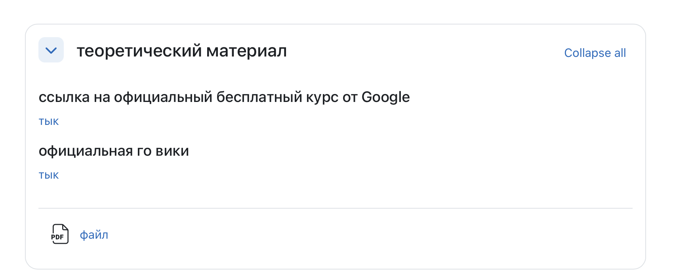

### практика с полезными сайтами
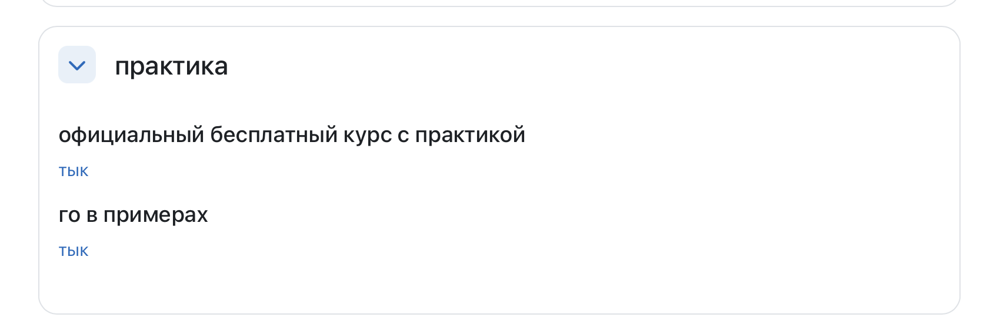

### справочник
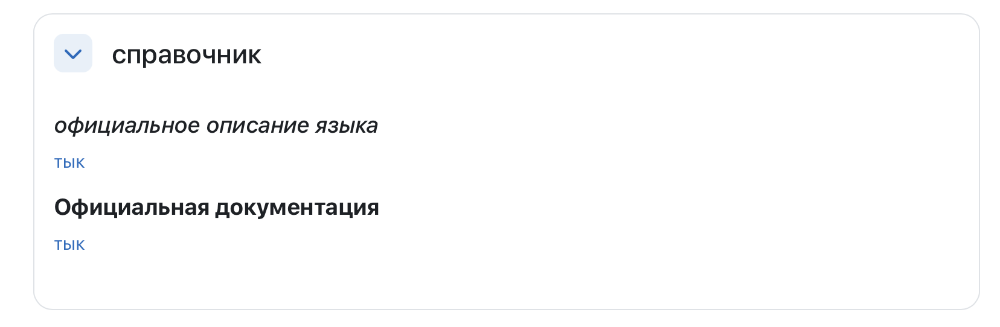

### Контрольное задание 
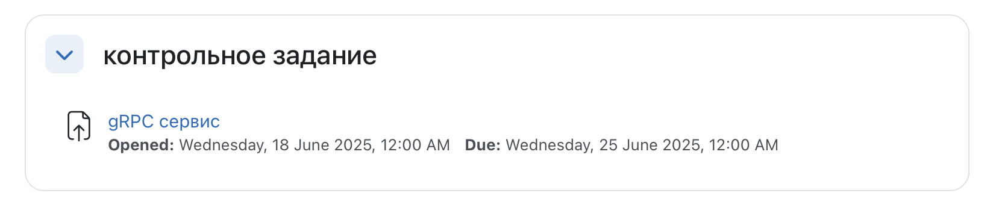
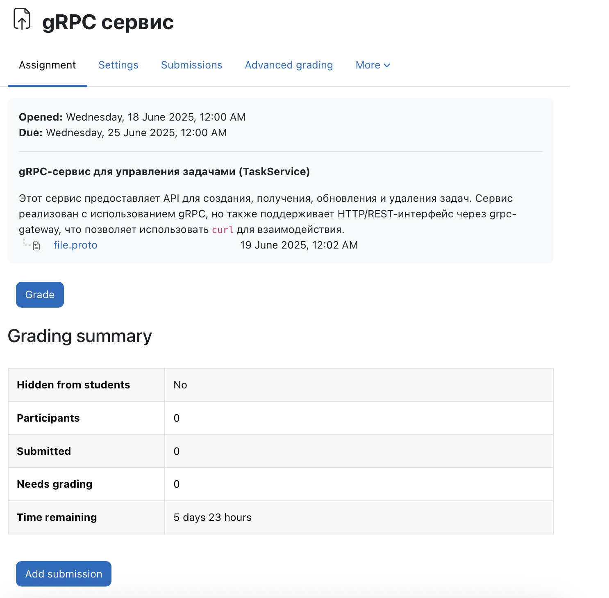

к заданию прикреплены справочные материалы и proto контракт для выполнения

### Тест
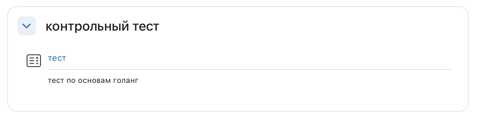
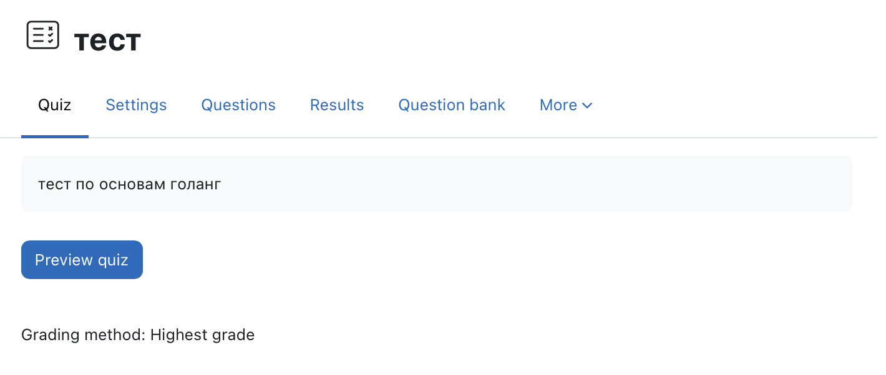
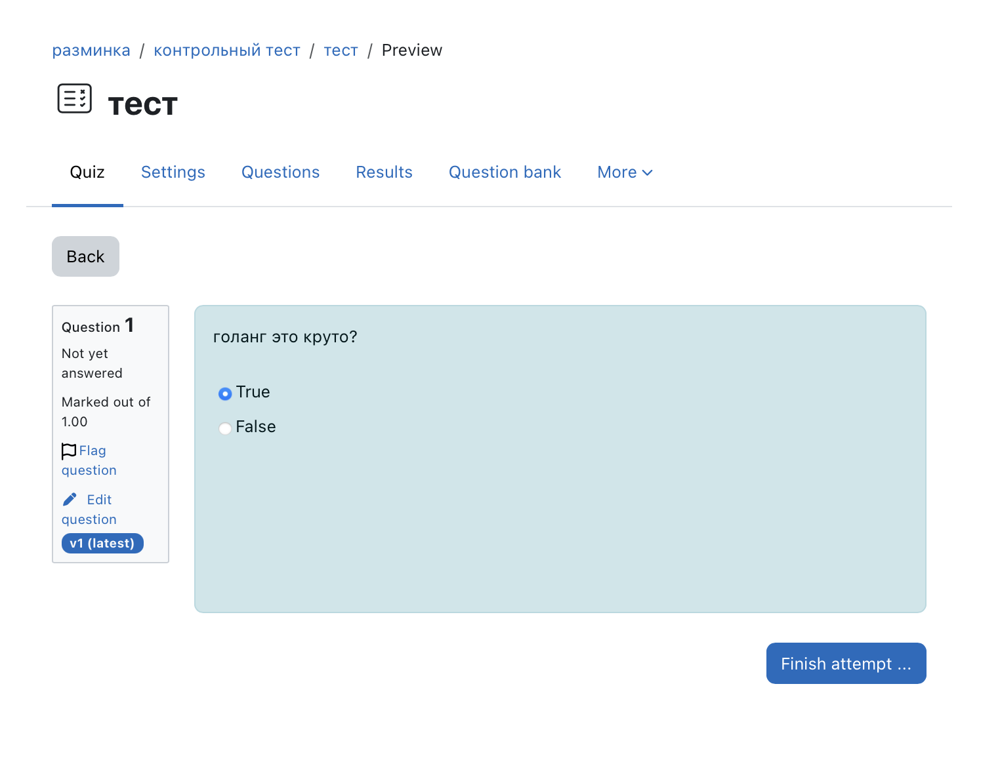
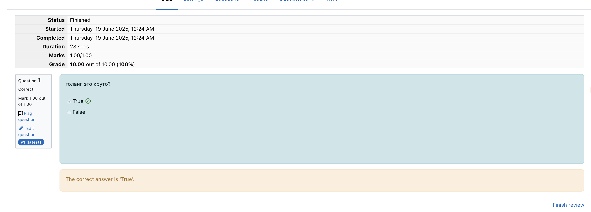

### информация по курсу
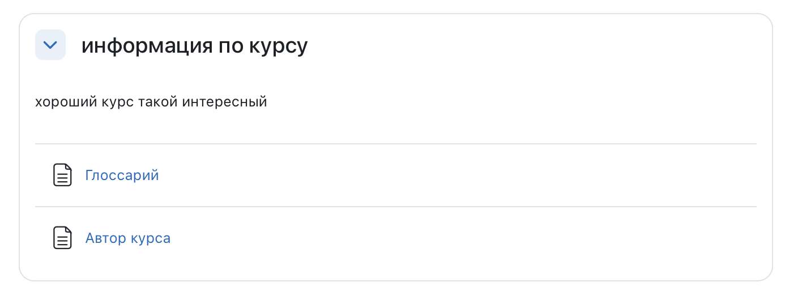

#### Глоссарий
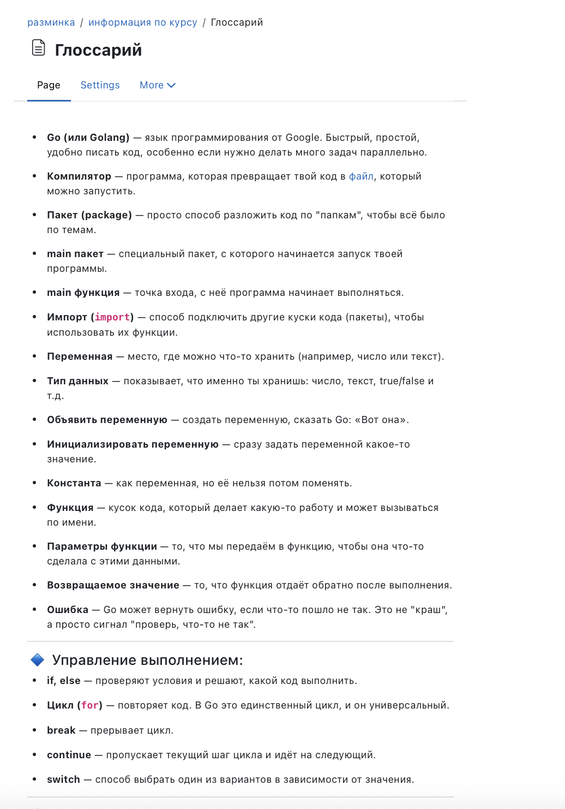
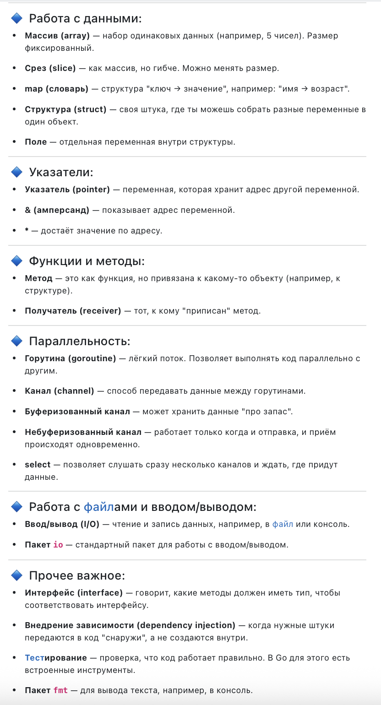

#### Автор
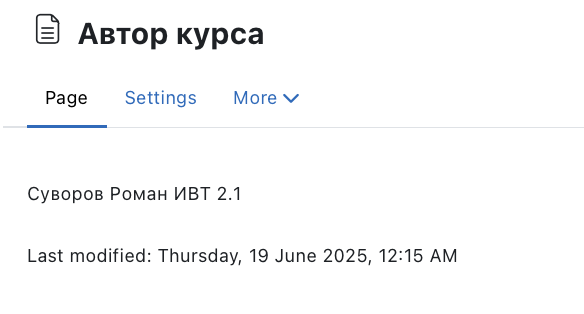