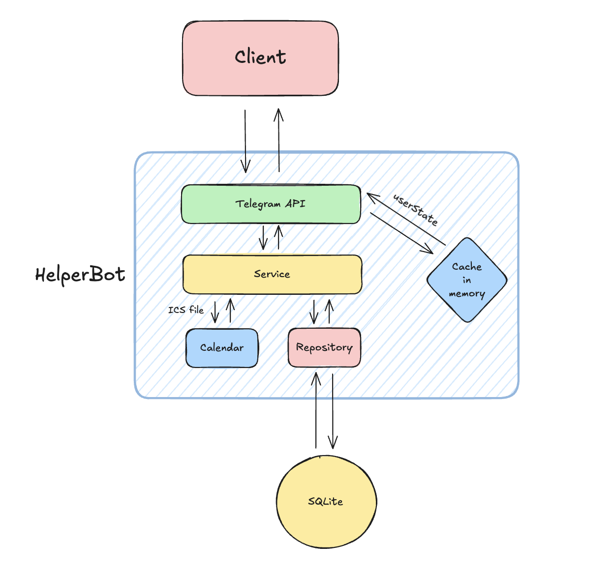
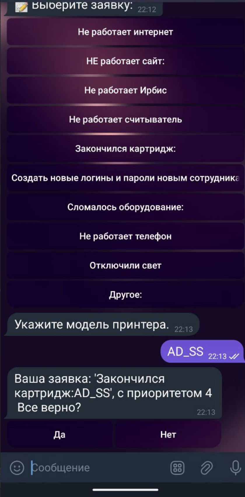
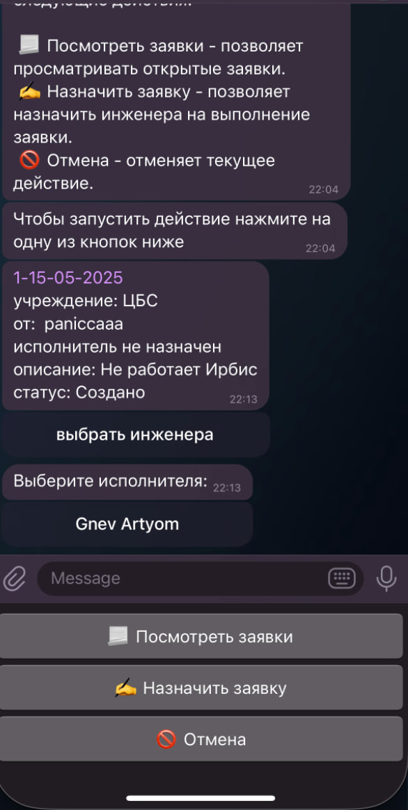
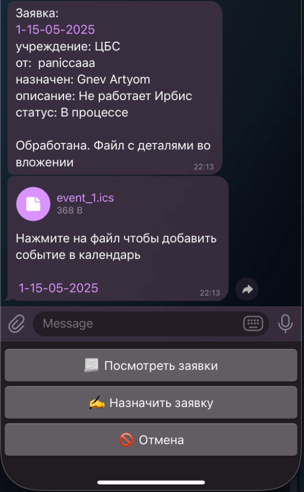
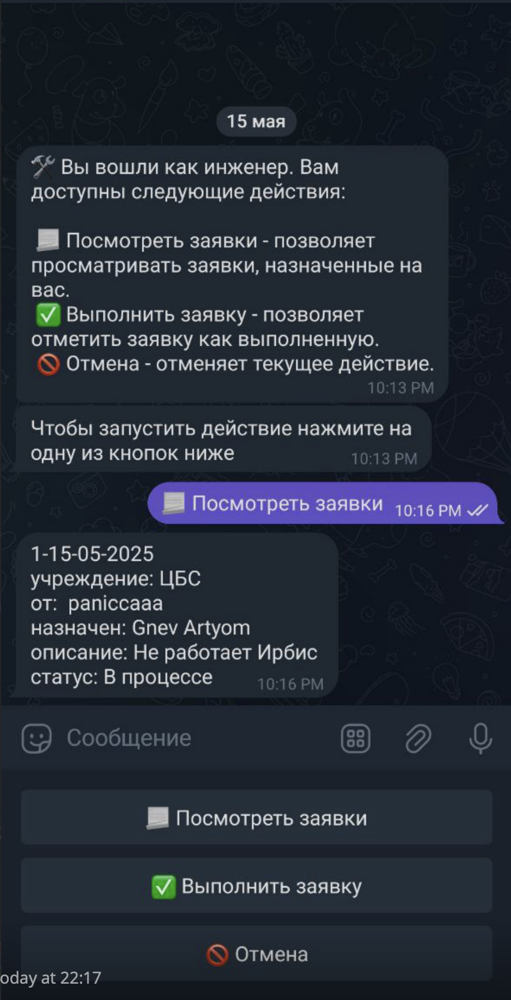

**РАЗРАБОТКА СИСТЕМЫ УПРАВЛЕНИЯ ЗАДАЧАМИ НА БАЗЕ TELEGRAM-БОТА: ПРАКТИЧЕСКОЕ РУКОВОДСТВО**

**Суворов Роман , Адаменко Семён, Гневнов Артем**

**_Аннотация._** В данной статье представлено практическое руководство по разработке системы управления задачами на базе Telegram-бота. Рассмотрены ключевые аспекты проектирования архитектуры, реализации функциональности и интеграции с популярным мессенджером.

**_Ключевые слова_:** Telegram-бот, система управления задачами, Go, SQLite.


**Введение**


Предметная область, для которой разрабатывается приложение, относится к сфере управления задачами и проектами. В современном мире разработчики часто сталкиваются с необходимостью создания систем управления задачами, и эффективное управление задачами является критически важным аспектом для успешной работы как отдельных специалистов, так и целых организаций. В данной статье мы рассмотрим практический подход к разработке такой системы с использованием Telegram в качестве основного интерфейса.

Особенностью разрабатываемого решения является использование Telegram в качестве основного интерфейса взаимодействия с системой. Это обусловлено тем, что большинство пользователей уже активно используют этот мессенджер в повседневной жизни, что значительно снижает порог входа в систему и повышает вероятность её активного использования. В отличие от специализированных приложений и веб-интерфейсов, которые требуют дополнительной установки и обучения, Telegram-бот предоставляет привычный и интуитивно понятный способ взаимодействия.


При разработке системы управления задачами важно учитывать следующие аспекты:

- необходимо реализовать систему ролей пользователей (администратор, инженер, библиотекарь) с различными правами доступа и функционалом;
- система должна обеспечивать полный цикл жизни задачи;
- приложение должно отправлять уведомления о новых задачах;
- система должна поддерживать работу с базой данных для хранения информации о задачах и пользователях;
- интерфейс бота должен быть интуитивно понятным и удобным для пользователей.

**Проектирование архитектуры приложения**
архитектура приложения:




Архитектура приложения построена на принципах чистой архитектуры, что обеспечивает четкое разделение ответственности между слоями и упрощает поддержку и развитие системы. Основные слои приложения:

1. Слой репозиториев (repository):
   - core: отвечает за базовые операции с данными, включая работу с пользователями и задачами
   - calendar: обеспечивает интеграцию с календарными приложениями через формат ICS

1. Слой бизнес логики (service):
   - Реализует бизнес-логику приложения
   - Обрабатывает логикой
   - Обращается к слою репозитория

3. Слой приложения (app):
   - Обрабатывает команды и сообщения от Telegram
   - Управляет пользовательским интерфейсом
   - Обеспечивает валидацию входных данных
   -  Обращается к слою бизнес логики

Выбор технологий для реализации проекта был обусловлен следующими факторами:

- Язык программирования Go был выбран благодаря его высокой производительности, простоте разработки и хорошей поддержке конкурентного программирования.
- SQLite был выбран в качестве базы данных из-за его простоты использования, отсутствия необходимости в отдельном сервере и достаточной производительности для данного проекта.
- telebot[69] был выбран как платформа для взаимодействия с пользователями благодаря своей популярности и надежности.
- Поддержка формата ICS (iCalendar) была добавлена для возможности экспорта задач в календарные приложения, что позволяет пользователям интегрировать задачи в свои привычные календари и получать напоминания через стандартные календарные приложения.

**Реализация функциональности**

Пример последовательности взаимодействия сервисов внутри приложения при вызове ручки CreateRequest:

[](https://editor.plantuml.com/uml/dLN1RjD04BtlLymn0IKV42cbLU92f4B1DkA8jl4AB3bni3S1RYMe4b8h8VN2cJzmQICYegI_CFj7pCQRs4bCINAmrhkUUJFxvituC9OyalrEm7XRXX4q0bzq9MCzElNRVezt9RWY4EyYtZbwsLevRuIHS4GqyDjYuzmMlJ3s2V4pyxZaPpmMuBmwyUMQAGz4r-DHpfpLwu0_SOQ_yGuJdE8OHq2RH7t7N_W7nr2lCvRc2PM3V7QrdACQggkSc_ggB-WFk1Ghzs6vZKPBSMiGlmy_sk93NyJI5PrUG7uEMH94s2srmwuKdsIPUQ8Oz5_PNQjBl57dysibeBxHomrEAELf9NV3PCjKC_fhy5J8rx68IjBOj9hb32LVA9RRB50ozhS0ofTgTQ_XqXhNmB5Eh8OBZ-3OFdqEVKACuSqpoxPW0VpMzw0EJp9m8uzqWKf1RZgnFEV6OoEDTNBM_OgkiQHalMX5paio_w-U8y_pjMXuqAG-oAGpb_arrNk6Tq22dU4zFHEjTpN44KxK5KxLfRe0qmPcCmRr1MVgmgXej6k3_20t4udiHshuG72DkmoEeprasOW4sHigIb6wQYBsL6SXtbu2RRrmBDkbnJq5WnD3gLgjbdTHfCcarTn7biPvQsKU58pB1INMWAfTH4Z1WDqysypjs0y4bFGm8bbeaUcHUaxhJ8lYdbx7U4kV4XfYHeChux0mxaDjPiY0n_FGkpRScZSxfE3wf_ON)


   Реализация системы уведомлений основана на механизме состояний пользователей, который позволяет отслеживать текущий контекст взаимодействия и отправлять релевантные уведомления. Ниже представлен пример реализации:

   ```go
   // UserState хранит текущее состояние взаимодействия пользователя с ботом.
type UserState struct {
	// PendingAction — действие, которое бот ожидает получить от пользователя (например, ввод даты или комментария).
	PendingAction string
	// Role — роль пользователя (админ, сотрудник отдела и т.п.), влияет на логику обработки запросов.
	Role model.Role 
	// Department — к какому отделу относится пользователь, для маршрутизации заявок.
	Department model.Department
	// Request — объект заявки, собираемой в ходе диалога.
	Request model.Request
	// Messages — список отправленных ботом сообщений, чтобы можно было их удалить при очистке состояния.
	Messages []*telebot.Message
}

// UserStateCache реализует потокобезопасный кеш состояний пользователей.
// Для каждого пользователя храним состояние и время истечения (TTL), периодически очищая устаревшие записи.
type UserStateCache struct {
	mu          sync.RWMutex 
	data        map[model.TelegramID]UserState  // сам кеш: ключ — telegramID, значение — состояние
	expiration  map[model.TelegramID]time.Time  // время истечения для каждого состояния
	ttl         time.Duration                   // время жизни записи в кеше
	cleanupTick time.Duration                   // интервал запуска фоновой очистки
	bot         Bot                             // API бота для удаления сообщений при очистке
}

// Set сохраняет или обновляет состояние пользователя с заданным telegramID.
// Одновременно устанавливает новое время истечения записи (now + ttl).
func (c *UserStateCache) Set(id model.TelegramID, state UserState) {
	c.mu.Lock()
	defer c.mu.Unlock()

	c.data[id] = state
	c.expiration[id] = time.Now().Add(c.ttl)
}

// Get возвращает текущее состояние пользователя и флаг наличия данных в кеше.
// Если записи нет, ok == false.
func (c *UserStateCache) Get(id model.TelegramID) (UserState, bool) {
	c.mu.RLock()
	defer c.mu.RUnlock()

	state, ok := c.data[id]
	return state, ok
}

// cleanup удаляет из кеша все записи, срок жизни которых истёк.
// Перед удалением также удаляет все связанные сессией сообщения через Bot.DeleteList.
func (c *UserStateCache) cleanup() {
	c.mu.Lock()
	defer c.mu.Unlock()

	now := time.Now()
	for id, expTime := range c.expiration {
		if now.After(expTime) {
			// Если запись всё ещё в data, удаляем связанные сообщения
			if state, exists := c.data[id]; exists {
				if err := c.bot.DeleteList(state.Messages); err != nil {
					slog.Error("delete messages during cleanup", "error", err)
				}
			}
			// Полностью удаляем устаревшую запись
			delete(c.data, id)
			delete(c.expiration, id)
		}
	}
}

   ```
   
Помимо базовых методов `Set`/`Get`, для удобного и безопасного обновления отдельных полей состояния реализованы вспомогательные обёртки на основе `UpdateState`. Они позволяют добавлять сообщения и по-отдельности задавать роль, департамент, ожидаемое действие (`PendingAction`) и все ключевые поля структуры `Request` (ID, описания, приоритет, статус, ответственных и т. д.), не затрагивая остальное состояние пользователя.
Данный механизм обеспечивает эффективное управление состояниями пользователей и позволяет системе сохранять состояние пользователя и отправлять контекстно-зависимые уведомления.


#### Пример пользовательского интерфейса в разных случаях:
меню админа:


создание заявки:


назнавение заявки:


созданная заявка:


просмотр заявки инжинером:



**Примеры реализации**

Для демонстрации ключевых аспектов реализации работы telebot, рассмотрим пример работы с апи бота:

```go
// Handler объединяет основные компоненты приложения для обработки сообщений от пользователей.
type Handler struct {
	// coreService — бизнес-логика приложения (получение/создание заявок и т.п.).
	coreService Service
	// bot — интерфейс работы с Telegram Bot API (отправка и получение сообщений).
	bot         Bot
	// userStates — кеш пользовательских состояний для управления контекстом диалога.
	userStates  *app.UserStateCache
}

// NewHandler создаёт и возвращает новый экземпляр Handler.
// Принимает на вход реализацию сервисного слоя, экземпляр бота и указатель на кеш состояний.
func NewHandler(service Service, bot Bot, cache *app.UserStateCache) *Handler {
	return &Handler{
		coreService: service,
		bot:         bot,
		userStates:  cache,
	}
}

// InitHandlers регистрирует все необходимые обработчики команд и текстовых сообщений.
func (h *Handler) InitHandlers() {
	h.initCommandHandlers()
	h.initTextHandlers()
}

// initCommandHandlers настраивает обработчики команд бота (например, /start, /help).
func (h *Handler) initCommandHandlers() {
	// Регистрируем команду "/start", которую будет обрабатывать метод Start.
	h.bot.Handle("/start", h.Start)
}

// initTextHandlers настраивает общий обработчик для всех текстовых сообщений.
// Здесь можно добавить логику разбора обычного текста от пользователя.
func (h *Handler) initTextHandlers() {
	// Регистрируем обработчик для любых входящих текстовых сообщений.
	h.bot.Handle(telebot.OnText, h.HandleText)
}


```


**Заключение**

Использование Telegram в качестве платформы для корпоративных решений имеет ряд существенных преимуществ для организаций:

1. Экономия ресурсов: нет необходимости разрабатывать и поддерживать отдельное приложение или веб-интерфейс
2. Масштабируемость: возможность легко добавлять новых пользователей без дополнительных затрат
3. Кроссплатформенность: доступ к системе с любого устройства через единый интерфейс
4. Интеграция: возможность подключения к существующим корпоративным системам через API

