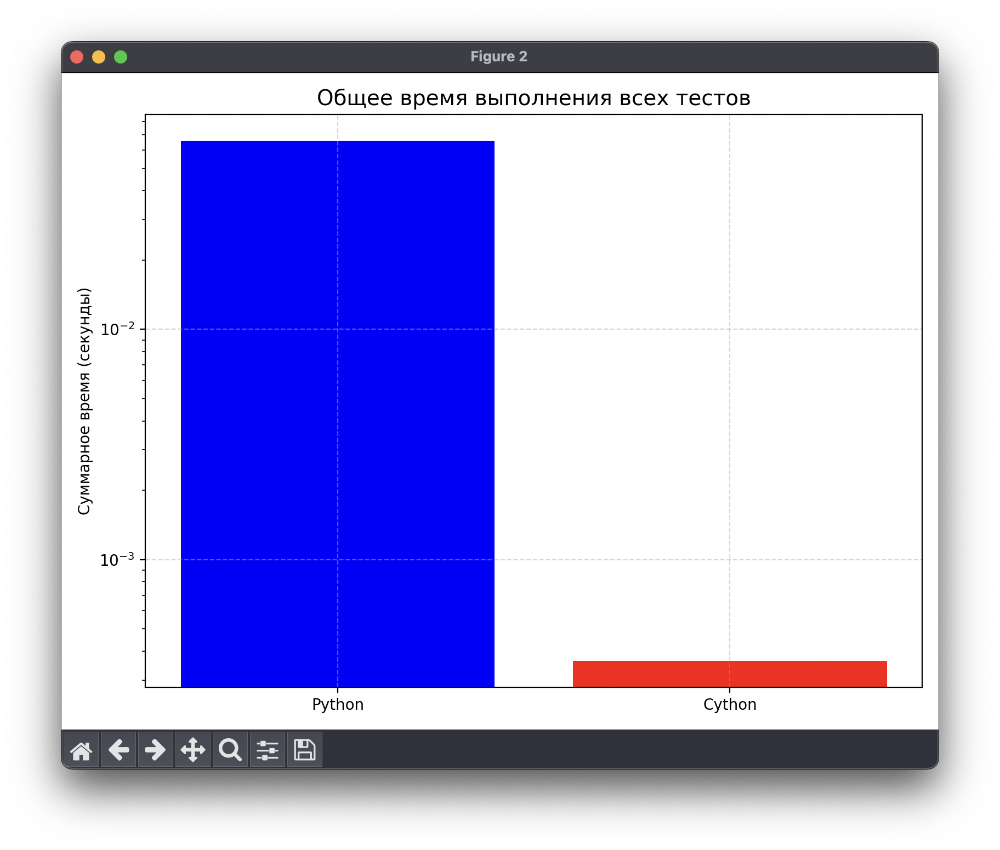
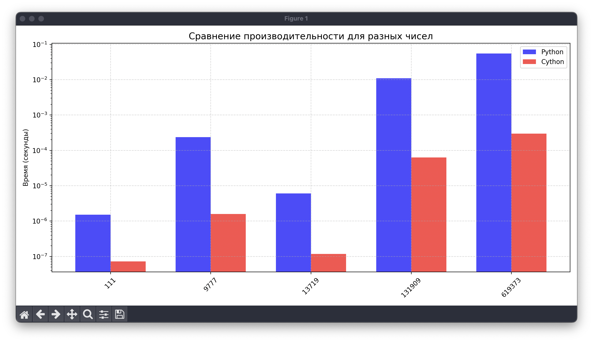

отчет:
```
Результаты тестирования (время на одну операцию):
---------------------------------------------------------------------------
Число           |   Python (s) |   Cython (s) |    Ускорение
---------------------------------------------------------------------------
111             |   1.51e-06 |   7.21e-08 |       21.0x
9777            |   2.37e-04 |   1.58e-06 |      149.9x
13719           |   6.08e-06 |   1.18e-07 |       51.5x
131909          |   1.10e-02 |   6.30e-05 |      174.7x
619373          |   5.49e-02 |   2.98e-04 |      184.3x

Общее время выполнения всех тестов:
---------------------------------------------
Python: 3.34e+01 секунд
Cython: 1.82e-01 секунд
Ускорение: 184.0x
```




