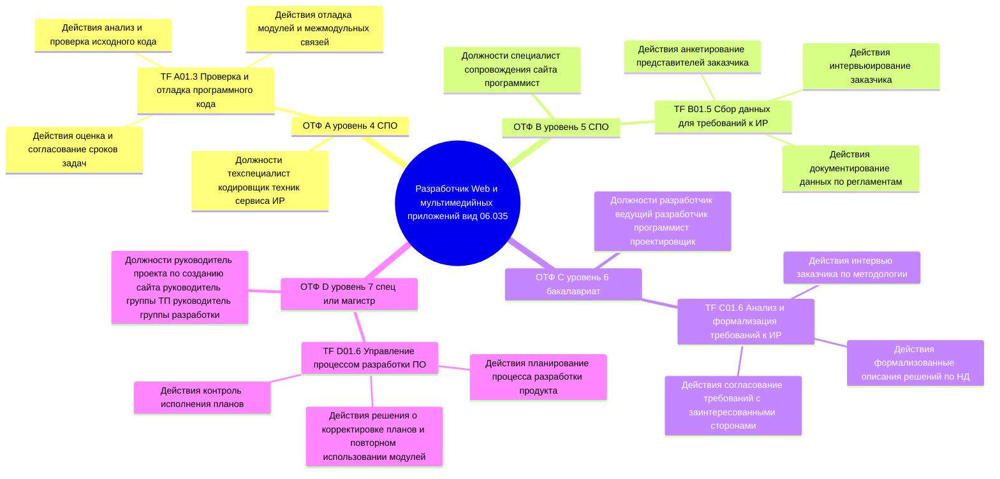
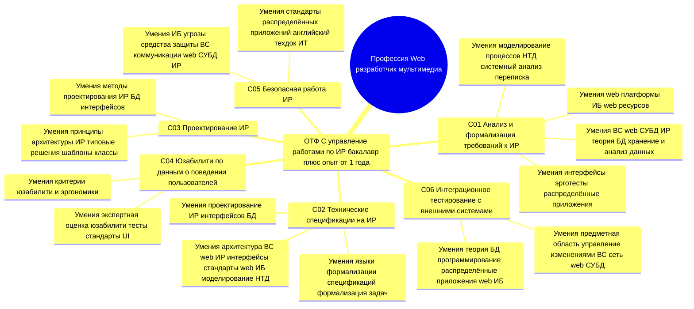

# Лабораторная работа. Профстандарт 882, ОТФ и интеллект-карты

**Документ:** Профессиональный стандарт «**Разработчик Web и мультимедийных приложений**», рег. № **882**, утв. приказом Минтруда России от 18.01.2017 № 44-н. Вид профессиональной деятельности: **06.035** — проектирование, разработка и интеграция информационных ресурсов в ЛВС и сети Интернет.

---

## 1. Сведения из стандарта

Стандарт задаёт **четыре обобщённые трудовые функции (ОТФ)** с кодами **A**, **B**, **C**, **D** и развёрнутым описанием **трудовых функций**, **должностей**, **трудовых действий**, **необходимых умений** и **знаний**.

---

## 2. Перечень ОТФ с требованием к образованию «высшее образование — бакалавриат»

По тексту раздела III профстандарта требование **«Высшее образование — бакалавриат»** указано в блоке **одной** обобщённой трудовой функции:

| Код ОТФ | Наименование обобщённой трудовой функции | Уровень квалификации | Требование к образованию |
|---------|------------------------------------------|----------------------|---------------------------|
| **C** | Управление работами по созданию (модификации) и сопровождению информационных ресурсов | 6 | **Высшее образование — бакалавриат** |

Для сопоставления (в перечень **бакалавриата** не входят):

| Код ОТФ | Требование к образованию по стандарту |
|---------|----------------------------------------|
| A | Среднее профессиональное образование — программы подготовки специалистов среднего звена |
| B | Среднее профессиональное образование — программы подготовки специалистов среднего звена |
| D | Высшее образование — специалитет, магистратура (и дополнительное профессиональное образование в сфере проектного менеджмента для уровня 7) |

Дополнительно для **ОТФ C** установлено: опыт работы в области разработки информационных ресурсов **не менее одного года**; возможно **дополнительное профессиональное образование** — программы повышения квалификации.

---

## 3. Интеллект-карта 1: профессия — ОТФ — трудовая функция — должности — трудовые действия

Связь уровней отражена в одной **mindmap**: корень — профессия по виду деятельности; ветви — **четыре ОТФ**; для каждой ОТФ — **пример трудовой функции** с кодом, **возможные наименования должностей** из стандарта для этой ОТФ и **формулировки трудовых действий** (по выбранному примеру ТФ).

---

## 4. Интеллект-карта 2: профессия — ОТФ C — компетенции из необходимых умений

Для **ОТФ C** (бакалавриат) показана связь с **шестью трудовыми функциями** C/01.6–C/06.6 и с **ключевыми формулировками блока «Необходимые умения»** по каждой функции (полный перечень умений в стандарте шире; на карте — содержательные группы без дублирования очевидного).

---

## 5. Примечание к оформлению

Обе диаграммы в формате **Mermaid** `mindmap` совместимы с просмотром в VS Code / JetBrains и с экспортом в изображение через сервисы рендеринга Mermaid для загрузки в систему курса.
