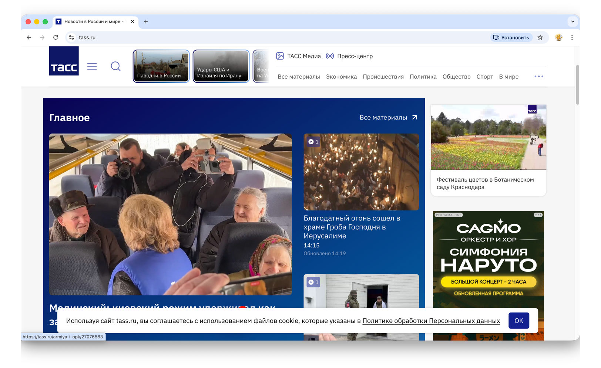

# Информационное агентство **ТАСС**

**Учебная презентация**  
Дисциплина: мировые информационные ресурсы и цифровые библиотеки

_Объект: официальный сайт агентства и открытые сведения о ФГУП_

---

## Название и год создания

|                                   |                                                                                                                                         |
|-----------------------------------|-----------------------------------------------------------------------------------------------------------------------------------------|
| **Публичный бренд**               | ТАСС (англ. TASS)                                                                                                                       |
| **Юридическое лицо**              | ФГУП «Информационное телеграфное агентство России (ИТАР-ТАСС)»                                                                          |
| **Считаемая дата начала истории** | **1 сентября 1904 г.** — первый рабочий день Санкт-Петербургского телеграфного агентства (СПТА), от которого агентство ведёт хронологию |
| **Современный правовой статус**   | Центральное **государственное** информационное агентство; учредитель — **Правительство РФ** (по уставу ФГУП)                            |

---

## Скриншот сайта

Рис. 1. Главная страница **https://tass.ru**

---

## Цель и задачи агентства

**Цель (обобщённо по уставу ФГУП и публичным материалам):** обеспечение **оперативного, широкого и системного** информирования аудитории о жизни России и мире; участие в формировании **официальной информационной повестки** как государственного агентства.

**Задачи (по смыслу [Устава ФГУП «ИТАР-ТАСС»](http://archive.government.ru/gov/gagencies/202/base.html), п. 10 и разделов о деятельности):**

- освещение **государственной политики** и **общественной жизни** РФ, а также значимых мировых событий;
- производство и распространение **информационной продукции** (тексты, фото, видео, спецпроекты) для СМИ, органов власти, коммерческих подписчиков;
- развитие **цифровых сервисов** (сайт, терминалы, медиабанк, мультиязычность);
- **международное** присутствие (корпункты, партнёрства с зарубежными агентствами).

---

## Основные направления деятельности

- **Новостное агентство:** лента сообщений, репортажи, справки, интервью.
- **Мультимедиа:** фото-, видеослужбы, пресс-центры, онлайн-трансляции.
- **Издательская и проектная деятельность:** журналы, бюллетени, тематические порталы (часть изданий — **отдельные СМИ** в реестре РКН).
- **ИТ и распространение:** платформы доступа к контенту для подписчиков, архивы, **медиабанк**.
- **Международное сотрудничество:** членство в профильных ассоциациях агентств (EANA, OANA и др.).

---

## Тематические направления контента (сайт **tass.ru**)

Информационные разделы типичны для крупного **универсального** агентства:

- **Общество и политика**, **экономика и бизнес**, **международная** повестка
- **Армия и ОПК**, **происшествия**, **спорт**
- **Культура**, **наука** (в т. ч. отдельные вертикали вроде **nauka.tass.ru**)
- **Официальные** сообщения и **оперативные** сводки, в том числе на основе материалов **ведомственных** и **пресс-служб**

По структуре сайта представлены разделы о **деятельности органов власти** и **государственной политике**, а также **спорт**, **культура**, **наука** и другие **общественно значимые** темы.

---

## Возрастные ограничения

- Ресурс **tass.ru** ориентирован на **широкую аудиторию** читателей; подробные правила использования сайта и работы с контентом приведены в **пользовательских документах** в подвале страницы (пользовательское соглашение, политика обработки персональных данных).
- При необходимости отдельные материалы сопровождаются **информационными пометками** в соответствии с **редакционной политикой** и требованиями к распространению информации в сети.
- Для отчёта по заданию целесообразно **зафиксировать** соответствующие **формулировки** со скриншота подвала сайта на дату подготовки работы.

---

## Управление: редактор, редакция

| Роль | Сведения (открытые источники, **проверить на дату сдачи**) |
|------|----------------------------------------------------------------|
| **Генеральный директор** | **Кондрашов Андрей Олегович** — указывается как руководитель ФГУП; в публичных сообщениях 2025 г. также фигурирует как **главный редактор** агентства |
| **Редакция СМИ** | **ФГУП «ИТАР-ТАСС»** выступает **учредителем/редакцией** информационного агентства в реестре РКН; состав **редакционной коллегии** и контакты **пресс-службы** уточняются в разделе **«О нас»** на сайте агентства |
| **Заместители** | блок заместителей генерального директора (операционное управление службами) |

---

## Регистрация СМИ

| Показатель | Значение |
|------------|----------|
| **Орган регистрации** | **Федеральная служба по надзору в сфере связи, информационных технологий и массовых коммуникаций (Роскомнадзор)** |
| **Наименование в реестре** | Информационное телеграфное агентство России (ИТАР-ТАСС) |
| **Регистрационный номер свидетельства** | **№ 03247** (форма распространения: **информационное агентство**; дата регистрации в открытых агрегаторах реестра — **02.04.1999**) |
| **Территория распространения** (по данным реестровых выписок) | Российская Федерация, СНГ, зарубежные страны |

---

## Структура агентства и сайта

**Организационная структура (логика ФГУП):**

- центральный аппарат (**Москва**, б-р Тверской, д. 10, стр. 1);
- **региональные информационные центры** и **корпункты** в субъектах РФ;
- **зарубежные представительства**;
- тематические **службы** (политика, экономика, спорт, фото, видео, спецпроекты и др.).

**Структура сайта (навигация):**

- **шапка:** тематические разделы и сервисы;
- **лента:** хронологическая лента новостей, дайджесты;
- **мультимедиа** и **спецпроекты**;
- **подвал:** контакты, **социальные сети**, документы, RSS.

---

## Источники информации агентства

- **Собственные корреспонденты** (Россия и зарубежье), **оперативные группы**.
- **Официальные** источники: **пресс-службы** органов власти, ведомств, судов, компаний.
- **Партнёры и подписчики**, **пресс-конференции** и мероприятия в **пресс-центрах** ТАСС.
- **Мониторинг** открытых данных, **документы**, **статистика**, **эксперты** (в аналитических материалах).
- **Международный обмен** с другими агентствами (в рамках договоров и ассоциаций).

---

## Оценка качества информации *(аналитическая часть)*

| Критерий | Комментарий |
|----------|-------------|
| **Актуальность** | Высокая: круглосуточное обновление ленты, оперативное освещение событий. |
| **Достоверность** | Сведения приводятся с указанием **источника** (пресс-службы, **официальные** представители, **документы**), что соответствует практике **государственного** информационного агентства и требованиям к проверяемости новостной информации. |
| **Полнота** | Широкий охват тематик; степень детализации зависит от **жанра** материала (новость, справка, интервью, аналитика). |
| **Стиль подачи** | **Официально-деловой**, **информационный** тон, акцент на **фактах** и **комментариях уполномоченных** лиц; оформление соответствует статусу **ведущего** отечественного агентства. |

---

## YouTube и социальные сети

- **Видео:** официальное присутствие на **Rutube** — канал ТАСС: [https://rutube.ru/channel/23950585/](https://rutube.ru/channel/23950585/)
- **YouTube:** актуальную ссылку на канал агентства возьмите из **подвала** или **шапки** сайта **tass.ru** (верифицированные каналы периодически обновляются).
- **Соцсети:** **Telegram** (в т. ч. @tass_agency, трансляции @tass_live — по состоянию на открытые справочники), **VK**, **Дзен** и др. — иконки в интерфейсе **tass.ru**.

---

## URL

**Основной адрес:** [https://tass.ru](https://tass.ru)

---

## Общее впечатление от сайта

- **Стиль изложения:** сжатый **новостной** формат, информативные заголовки, **официально-деловая** лексика, **информационный** характер подачи материалов.
- **Дизайн:** строгая **корпоративная** палитра, крупная типографика, акцент на **читаемость** и плотность ленты.
- **Интерфейс:** быстрый доступ к разделам, **мобильная** версия; много **медиа** (фото/видео) в материалах.

---

## Источники, использованные при подготовке

1. Официальный сайт ТАСС: [https://tass.ru](https://tass.ru), в т. ч. разделы «О нас» / справочная информация.
2. Перечень информационных агентств (рабочий документ курса): [Google Docs — «Информационные агентства и ресурсы России»](https://docs.google.com/document/d/1-L3jN32GqTZNHKnjOBBq2Crowr3PPcgj/edit?rtpof=true&sd=true).
3. Устав ФГУП «Информационное телеграфное агентство России (ИТАР-ТАСС)» (постановление Правительства РФ, ред. актуальна на дату проверки): публикация на [архивном портале Правительства РФ](http://archive.government.ru/gov/gagencies/202/base.html).
4. Справочно-энциклопедические сведения: [Википедия — ТАСС](https://ru.wikipedia.org/wiki/%D0%A2%D0%90%D0%A1%D0%A1).
5. Реестр зарегистрированных СМИ Роскомнадзора (сведения о свидетельстве **№ 03247**): [rkn.gov.ru](https://rkn.gov.ru/) — **обязательная** перепроверка номера и статуса.
6. Справочные карточки организации (ИНН, ОГРН, руководитель): например [audit-it.ru](https://www.audit-it.ru/contragent/1037700049606_itar-tass-tass), [list-org.com](https://www.list-org.com/company/618961).
7. Официальный канал на Rutube: [https://rutube.ru/channel/23950585/](https://rutube.ru/channel/23950585/).

