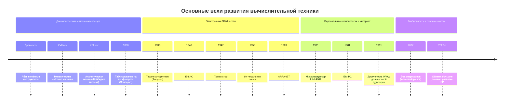

# Вариативная самостоятельная работа 10

**Дисциплина:** мировые информационные ресурсы и цифровые библиотеки  
**Задание:** 10.1. Лента времени развития вычислительной техники

---

## Цель

Составить **ленту времени** с **датами (вехами)** и **иллюстрациями**, охватывающую развитие вычислительной техники **от ранних средств счёта до современной эры** (персональные компьютеры, сеть, мобильные и облачные технологии, развитие систем искусственного интеллекта).

---

## Лента времени (вехи и изображения)

### 1. Счёты и абак (~III тысячелетие до н. э. — античность; совершенствование вплоть до Нового времени)

**Веха:** появление **абака** и родственных счётных инструментов как практического средства арифметики; фундамент **алгоритмических** действий «по позициям».

*Рис. 1. Японский абак соробан (файл Soroban.jpg, Wikimedia Commons).*

---

### 2. 1623–1624 гг. — механический калькулятор (Шиккард; затем развитие у Паскаля и Лейбница)

**Веха:** **механические** цифровые (в смысле дискретных позиций) устройства для сложения и умножения.

*Рис. 2. Арифмометр (механический калькулятор, около 1887 г.; файл Arithmometre.jpg, Wikimedia Commons).*

---

### 3. 1822–1837 гг. — Чарльз Бэббидж: разностная и **аналитическая** машина (проект)

**Веха:** идея **программируемого** вычисления, **памяти** и **управления** с помощью перфокарт (концепция, близкая к современным ЭВМ).

*Рис. 3. Фрагмент аналитической машины Бэббиджа, Science Museum, Лондон (файл AnalyticalMachine_Babbage_London.jpg).*

---

### 4. 1890 г. — перфокарты **Германа Холлерита** (перепись населения США)

**Веха:** **механическая обработка больших массивов данных**; предпосылки **автоматизации** учёта и статистики.

*Рис. 4. Электрическая табулирующая машина системы Холлерита (начало XX в.; иллюстрация с Wikimedia Commons).*

---

### 5. 1936 г. — Алан Тьюринг: работа «On Computable Numbers…» (**машина Тьюринга**)

**Веха:** математическая модель **алгоритма** и **универсального вычисления**; теоретические основы **информатики**.

*Рис. 5. Алан Тьюринг, фото на паспорт в 16 лет (файл Alan_Turing_Aged_16.jpg, общественное достояние).*

---

### 6. 1945–1946 гг. — **ENIAC** (США)

**Веха:** одна из первых **электронных** вычислительных машин общего назначения; переход к **высокой скорости** счёта на электронных элементах.

*Рис. 6. Программирование ENIAC в лаборатории баллистических исследований (официальное фото Армии США, общественное достояние).*

---

### 7. 1947 г. — **транзистор** (Bell Labs)

**Веха:** замена ламп **полупроводниками**; путь к **компактным** и **надёжным** компьютерам.

*Рис. 7. Реплика первого точечного транзистора (Bell Labs, 1947; сувенирная копия).*

---

### 8. 1958 г. — **интегральная схема** (Джек Килби и развитие технологии)

**Веха:** миниатюризация; основа **современной электроники** и **микропроцессоров**.

*Рис. 8. Кремниевая пластина с чипами — наглядная иллюстрация эры **интегральных схем** и микроэлектроники после работ Джека Килби и развития технологии (файл Silicon_wafer.jpg, PD).*

---

### 9. 1969 г. — **ARPANET** (зарождение сети пакетной передачи)

**Веха:** прототип **глобальных компьютерных сетей**; предпосылки **Интернета**.

*Рис. 9. Логическая карта ARPANET (март 1977; файл Arpanet_logical_map,_march_1977.png).*

---

### 10. 1971 г. — микропроцессор **Intel 4004**

**Веха:** размещение **ЦПУ на одном чипе**; начало эры **массовой микроэлектроники**.

*Рис. 10. Микропроцессор Intel 4004 (файл Intel_C4004.jpg).*

---

### 11. 1981 г. — **IBM PC**

**Веха:** стандартизация архитектуры **персонального компьютера**; распространение ПК в офисе и доме.

*Рис. 11. IBM Personal Computer модель 5150 (файл IBM_PC_5150.jpg).*

---

### 12. 1989–1991 гг. — **World Wide Web** (Тим Бернерс-Ли, CERN)

**Веха:** **гипертекст**, **HTTP**, распределённые **документы**; глобальная **информационная среда**.

*Рис. 12. Рабочая станция NeXT, использованная Тимом Бернерсом-Ли как первый веб-сервер; на корпусе — предупреждение «This machine is a server. DO NOT POWER IT DOWN!!» (файл First_Web_Server.jpg).*

---

### 13. 2007 г. — массовый **смартфон** (Apple iPhone и экосистема аналогов)

**Веха:** **мобильный** доступ к сети, сенсорный интерфейс, **приложения** как канал ИТ-услуг.

*Рис. 13. Векторная схема первого iPhone (файл IPhone_1st_Gen.svg; в части просмотрщиков отображается как PNG-превью).*

---

### 14. 2020-е гг. — **облачные вычисления**, большие данные, **нейросети** и крупные языковые модели

**Веха:** вычисления как **сервис**; повсеместная **цифровизация**; развитие **ИИ** как прикладного инструмента (распознавание образов, обработка языка, рекомендательные системы).

*Рис. 14. Иллюстративное фото на тему ИИ и машинного обучения (файл Artificial Intelligence & AI & Machine Learning - 30212411048.jpg, CC BY 2.0).*

---

## Сводная диаграмма (Mermaid)

Ниже — компактное представление тех же этапов в виде **временной шкалы** (удобно для просмотра в редакторах с поддержкой Mermaid).

---

## Вывод

Развитие вычислительной техники можно представить как цепь **материальных изобретений** (механика → электроника → микросхемы → сети → мобильность) и **концептуальных прорывов** (программируемость, теория вычислимости, веб, облако). Лента времени наглядно показывает ускорение смены поколений технологий по мере приближения к **XXI веку**.

---

## Источники дат и иллюстраций

1. Общие хронологии истории вычислительной техники: учебные пособия по информатике, материалы **Computer History Museum**: [https://www.computerhistory.org/](https://www.computerhistory.org/)  
2. Иллюстрации: файлы **Wikimedia Commons**. Даны **прямые** ссылки на оригиналы вида `https://upload.wikimedia.org/wikipedia/commons/…/Имя_файла` (без подкаталога `/thumb/…`, который в ряде сетей или браузеров может не открываться). Полные сведения об авторах и лицензиях — на страницах файлов на [https://commons.wikimedia.org/](https://commons.wikimedia.org/).
