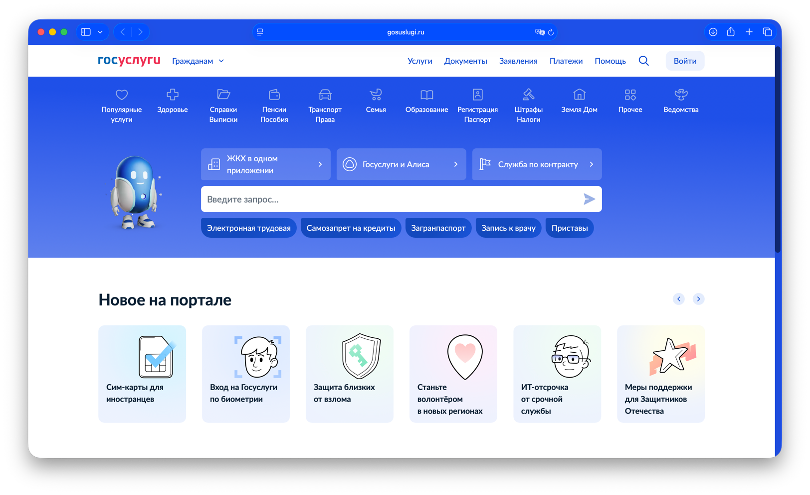

# Вариативное задание: выступление на практическом занятии 

**Дисциплина:** мировые информационные ресурсы и цифровые библиотеки  
**Тема:** информационные центры

---

## Тема выступления (формулировка)

**Единый портал государственных и муниципальных услуг (функций)** — **ЕПГУ** (**Портал Госуслуг**, [gosuslugi.ru](https://www.gosuslugi.ru)) как **федеральный информационный центр** для граждан и организаций: справки о услугах, приёмы электронных обращений, личный кабинет, интеграция с ведомствами.

---

## 1. Название ресурса, «год издания»

| Показатель | Содержание |
|------------|------------|
| **Полное наименование** | **Единый портал государственных и муниципальных услуг (функций)** |
| **Общепринятое название** | **Портал государственных услуг Российской Федерации**, **«Госуслуги»** |
| **Адрес в сети** | [https://www.gosuslugi.ru](https://www.gosuslugi.ru) |
| **Правовая основа** | Федеральный закон от **27.07.2010 № 210-ФЗ** «Об организации предоставления государственных и муниципальных услуг» (в части единого портала и электронного взаимодействия); иные акты Правительства РФ о развитии ЕПГУ и ГИС |
| **«Год издания» для отчёта** | **2010** — год принятия **210-ФЗ**; поэтапный запуск и развитие функций портала продолжались в последующие годы (актуальный перечень услуг и разделов — на сайте на дату выступления) |

---

## 2. Скриншот

*Рис. 1. Главная страница портала **gosuslugi.ru**.*

---

## 3. Основные направления деятельности и функции

**Назначение:** централизованное **информирование** о **государственных** и **муниципальных** услугах и функциях, приём **заявлений** и **обращений** в электронном виде (в пределах подключённых ведомств и регионов), ведение **учётной записи** пользователя, **оплата** отдельных платежей (где предусмотрено), **запись** на приём, **справочные** и **обучающие** материалы.

**Основные функции** (по структуре публичного интерфейса):

- **Каталог услуг и жизненных ситуаций** — поиск по темам (здоровье, образование, транспорт, социальная поддержка и др.);
- **Личный кабинет** — после регистрации и подтверждения учётной записи: статусы обращений, уведомления, персональные данные в рамках законодательства;
- **Запись на приём**, **подача заявлений**, **электронные обращения** в органы власти (в объёме, подключённом к ЕПГУ);
- **Информационные** и **обучающие** разделы, **новости**, **поддержка пользователей**;
- **Мобильное приложение** «Госуслуги» как продолжение портала;
- **Интеграция** с **ЕСИА** (единый вход и идентификация).

Курирование развития ЕПГУ осуществляет **Правительство Российской Федерации**; операторские и технологические функции реализуются в соответствии с решениями уполномоченных органов (актуальные сведения — в документах на [gosuslugi.ru](https://www.gosuslugi.ru) и на сайте [digital.gov.ru](https://digital.gov.ru)).

---

## 4. Система управления (руководство)

| Уровень | Содержание |
|---------|------------|
| **Стратегическое курирование** | **Правительство Российской Федерации** |
| **Отраслевой орган** | **Министерство цифрового развития, связи и массовых коммуникаций Российской Федерации** (Минцифры России) — ведение политики в сфере **цифровизации** госуслуг и развития ЕПГУ |
| **Руководство Минцифры** | **Министр цифрового развития, связи и массовых коммуникаций Российской Федерации** (ФИО уточнять на [digital.gov.ru](https://digital.gov.ru) на дату выступления) |

---

## 5. Структура сайта

- **Шапка:** вход в **личный кабинет**, **поиск**, переключение **языка** (при наличии), ссылки на **помощь**;
- **Главная:** **жизненные ситуации**, популярные услуги, **новости**, баннеры **государственных** программ (без сторонней коммерческой рекламы);
- **Каталог** услуг по ведомствам и темам;
- **Разделы для организаций** (юридических лиц и ИП), **электронный документооборот** с госорганами — по мере развития портала;
- **Подвал:** **контакты**, **пользовательское соглашение**, **политика ПДн**, ссылки на **социальные сети** и мобильные приложения.

---

## 6. Пользователи сайта

- **Физические лица** — граждане РФ и иные лица, оформляющие учётную запись в установленном порядке;
- **Юридические лица и ИП** — через сервисы для бизнеса (в объёме, предусмотренном порталом);
- **Органы власти** — как **поставщики** услуг и данных, интегрированные с ЕПГУ.

---

## 7. Оценка качества информации

| Критерий | Характеристика |
|----------|----------------|
| **Актуальность** | Высокая: обновление **каталога услуг**, **новостей**, **инструкций** при изменении **нормативной базы** и процедур |
| **Достоверность** | Официальный **государственный** ресурс; сведения о услугах привязаны к **ведомствам** и **нормативным актам** |
| **Полнота** | Широкий охват **федеральных** и **региональных** услуг; конкретная доступность сервиса может зависеть от **региона** и **готовности** органа |
| **Удобство** | Интерфейс ориентирован на **массового** пользователя; есть **поддержка** и **обучающие** материалы |

---

## 8. Расположение (город, страна)

**Страна:** Российская Федерация.  
**Юрисдикция и центры управления:** **федеральный** уровень (Москва — место нахождения **Минцифры России** и ключевых органов **Правительства РФ**). Портал доступен **по всей стране** и за рубежом при устойчивом доступе в Интернет.

---

## 9. Наличие рекламы

**Сторонней коммерческой рекламы** (баннеры частных брендов вне госпрограмм) на портале **нет**. Возможны **информационные блоки** о **национальных проектах**, **меры поддержки** и других **государственных** инициативах — это **официальная** коммуникация, а не коммерческий рекламный контракт.

---

## 10. URL

**Основной адрес:** [https://www.gosuslugi.ru](https://www.gosuslugi.ru)

---

## 11. Общее впечатление

Портал **Госуслуги** — наглядный пример **массового государственного информационного центра**: единая **точка входа** к **сведениям** о правах и процедурах, к **электронным** сервисам и **личному кабинету**. Интерфейс **понятный**, оформление **современное**, нагрузка на пользователя снижается за счёт **пошаговых** сценариев и **справки**. Ресурс устойчиво открывается в распространённых браузерах при стандартных настройках **доверенных** сертификатов.

---

## 12. Источники

1. Официальный портал: [https://www.gosuslugi.ru](https://www.gosuslugi.ru).  
2. Федеральный закон от 27.07.2010 № 210-ФЗ «Об организации предоставления государственных и муниципальных услуг» — [http://pravo.gov.ru](http://pravo.gov.ru).  
3. Сайт Минцифры России (материалы о цифровизации и ЕПГУ): [https://digital.gov.ru](https://digital.gov.ru).
