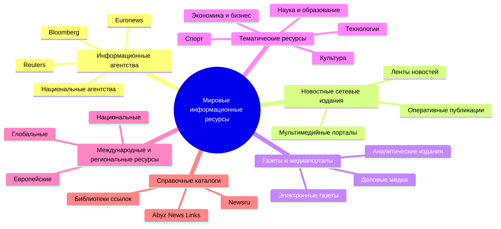

# Семинар 3. Мировые информационные агентства

**Дисциплина:** мировые информационные ресурсы и цифровые библиотеки  
**Тема:** мировые информационные агентства

---

## Задание 1. Интеллект-карта «Структура мировых информационных ресурсов»

На основе каталогов, указанных в задании, мировые информационные ресурсы можно представить как многоуровневую систему сетевых изданий, агентств, новостных платформ, справочных и тематических ресурсов.

### Краткий вывод

Мировые информационные ресурсы включают:

- **информационные агентства**;
- **новостные сайты и сетевые издания**;
- **газеты и медиапорталы**;
- **специализированные тематические ресурсы**;
- **региональные и международные новостные платформы**;
- **справочно-навигационные каталоги и медиагиды**.

### Интеллект-карта в виде структуры

**Мировые информационные ресурсы**

1. **Информационные агентства**
   - международные агентства: `Reuters`, `Bloomberg`
   - европейские и транснациональные агентства: `Euronews`
   - национальные и региональные агентства

2. **Новостные сетевые издания**
   - круглосуточные новостные порталы
   - мультимедийные платформы
   - сайты с лентой срочных новостей

3. **Газеты и медиапорталы**
   - электронные версии газет
   - аналитические издания
   - деловые и общественно-политические ресурсы

4. **Тематические информационные ресурсы**
   - наука и образование
   - экономика и бизнес
   - технологии
   - культура
   - спорт
   - здоровье

5. **Международные и региональные ресурсы**
   - глобальные англоязычные медиа
   - европейские ресурсы
   - ресурсы отдельных стран и регионов

6. **Справочные и навигационные ресурсы**
   - каталоги новостных ссылок
   - медиагиды
   - библиотеки интернет-ресурсов

### Mermaid-диаграмма

### Комментарий к заданию 1

Таким образом, структура мировых информационных ресурсов строится не по одному признаку, а сразу по нескольким: по **типу издания**, по **территории распространения**, по **тематике**, по **формату контента** и по **назначению ресурса**.

---

## Задание 2. Сравнение одной и той же новости на зарубежных информационных ресурсах

### Выбранная новость

Для сравнения выбрана научно-экологическая новость о том, что **2024 год стал самым тёплым годом за всю историю наблюдений и первым календарным годом, когда глобальная температура превысила 1,5°C относительно доиндустриального уровня**.

### Выбранные ресурсы

1. **Reuters**  
   Статья: [2024 was the hottest year on record, scientists say](https://www.reuters.com/business/environment/2024-was-first-year-above-15c-global-warming-scientists-say-2025-01-10/)

2. **Euronews**  
   Статья: [«Коперник»: в 2024-м глобальная температура впервые превысила на 1,5°C доиндустриальный уровень](https://ru.euronews.com/2025/01/10/copernicus-noted-an-absolutely-record)

### Даты публикации

| Ресурс | Дата публикации |
|--------|-----------------|
| **Reuters** | **10 января 2025 г.** |
| **Euronews** | **10 января 2025 г.** |

### Содержание новости

Обе публикации основаны на данных **Copernicus Climate Change Service** и сообщают, что:

- **2024 год** признан самым тёплым за всё время наблюдений;
- это первый календарный год, в котором средняя глобальная температура превысила **1,5°C** по отношению к доиндустриальному уровню;
- климатические изменения продолжают усиливаться и оказывают влияние на природные и социальные процессы.

### Сравнение трактовки

| Критерий | Reuters | Euronews |
|----------|---------|----------|
| **Тип подачи** | Более краткая, информационно-аналитическая подача | Более развернутая популярная подача для широкой аудитории |
| **Основной акцент** | Фактические показатели, комментарии ученых, связь с международной климатической повесткой | Объяснение значения рекорда, его общественных последствий и контекста |
| **Стиль** | Сдержанный, деловой, новостной | Более пояснительный и публицистически оформленный |
| **Источник данных** | Copernicus, WMO, ученые и официальные климатические структуры | Copernicus и дополнительные пояснения для читателя |
| **Целевая аудитория** | Международная профессиональная и массовая аудитория | Европейская и русскоязычная широкая аудитория |

### Вывод по сравнению

**Новости не являются полностью одинаковыми**, хотя сообщают об одном и том же факте.

Совпадают:

- **главный информационный повод**;
- **дата события и дата публикации**;
- **основные числовые показатели**;
- **ссылка на авторитетный научный источник**.

Различаются:

- **форма подачи материала**;
- **объем контекста**;
- **акцент на последствиях и интерпретации**;
- **ориентация на разную аудиторию**.

Следовательно, одна и та же международная новость в разных сетевых изданиях сохраняет **фактологическое ядро**, но отличается по **редакционному стилю**, **структуре изложения** и **глубине объяснения**.

---

## Выбранное агентство для презентации

Для презентации выбрано международное информационное агентство **Reuters**.

Презентация подготовлена в отдельном файле: `4.2/мирцб/семинар3/иср1_преза.md`

---

## Источники

1. Каталог `Newsru.com`: [https://www.newsru.com](https://www.newsru.com)  
2. Каталог `Abyz News Links`: [http://www.abyznewslinks.com](http://www.abyznewslinks.com)  
3. Подборка зарубежных новостных ресурсов: [https://iubip.ru/library/links/news/int/misc](https://iubip.ru/library/links/news/int/misc)  
4. Reuters: [https://www.reuters.com](https://www.reuters.com)  
5. Euronews: [https://ru.euronews.com](https://ru.euronews.com)  
6. Copernicus Climate Change Service: [https://climate.copernicus.eu](https://climate.copernicus.eu)  

