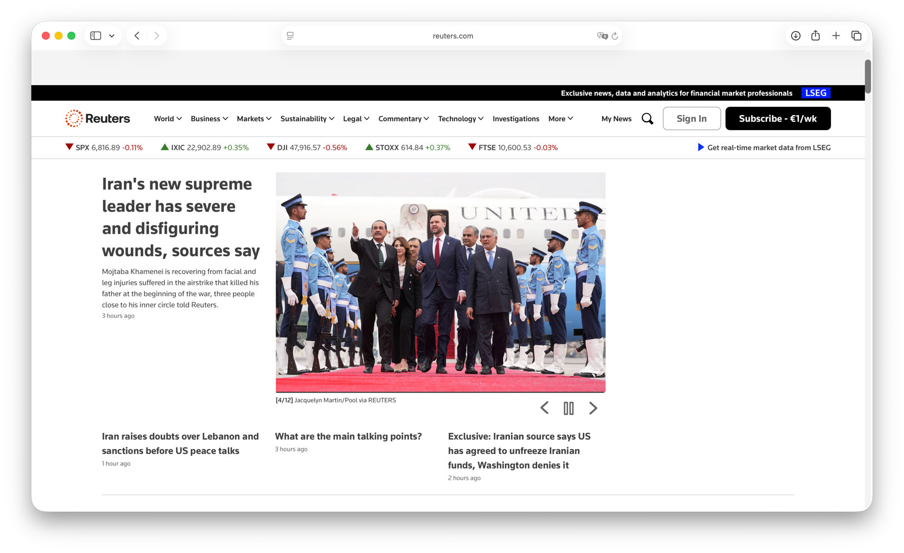

# Reuters

## Международное информационное агентство

Семинар 3  
Мировые информационные агентства

---

## Название ресурса, год издания

| Показатель | Сведения |
|------------|----------|
| **Название** | `Reuters` |
| **Год основания** | **1851** |
| **Основатель** | **Paul Julius Reuter** |
| **Исторический центр** | **Лондон, Великобритания** |
| **URL** | [https://www.reuters.com](https://www.reuters.com) |

---

## Скриншот сайта

*Рис. 1. Главная страница сайта Reuters.*

---

## Основные направления деятельности и функции

- оперативное распространение **международных новостей**;
- подготовка **текстовых**, **фото-** и **видеоматериалов**;
- деловая, экономическая, политическая, научная и технологическая информация;
- лицензирование контента для СМИ, корпораций, технологических компаний и государственных структур;
- предоставление архивных, аналитических и мультимедийных материалов.

По данным Reuters, агентство работает в **165 странах**, ведёт выпуск материалов на **12 языках** и использует глобальную сеть журналистов.

---

## Система управления

| Показатель | Сведения |
|------------|----------|
| **Собственник бренда Reuters** | `Thomson Reuters` |
| **President, Reuters** | **Paul Bascobert** |
| **Editor-in-Chief, Reuters** | **Alessandra Galloni** |
| **Модель управления** | корпоративная международная медиаструктура с редакционным руководством и глобальной сетью бюро |

---

## Структура сайта

- **верхнее меню** с рубриками: World, Business, Markets, Technology, Science, Lifestyle и др.;
- **главная лента** оперативных новостей;
- отдельные блоки с **фото**, **видео**, **аналитикой**;
- тематические страницы и страницы специальных проектов;
- служебные разделы: подписка, регистрация, лицензирование материалов, справка.

---

## Пользователи сайта

- широкая международная аудитория;
- журналисты и редакции СМИ;
- аналитики, инвесторы, деловые пользователи;
- государственные и корпоративные структуры;
- исследователи и преподаватели, использующие материалы как источник текущей информации.

---

## Оценка качества информации

| Критерий | Характеристика |
|----------|----------------|
| **Актуальность** | очень высокая, материалы публикуются оперативно |
| **Достоверность** | высокая, агентство опирается на редакционные стандарты и проверку фактов |
| **Полнота** | высокая по международной и деловой тематике |
| **Стиль** | деловой, краткий, информационный |

Reuters в официальных материалах подчёркивает приверженность **Trust Principles**: точности, независимости и беспристрастности.

---

## Расположение

| Параметр | Сведения |
|----------|----------|
| **Страна исторического центра** | Великобритания |
| **Город** | Лондон |
| **Глобальный масштаб** | международная сеть корреспондентов и бюро в разных странах |

---

## Наличие рекламы

- на сайте могут присутствовать элементы продвижения собственных продуктов, подписки и сервисов;
- агрессивная внешняя реклама не является основой структуры ресурса;
- на агентском направлении Reuters отдельно развивает рекламные и маркетинговые решения для клиентов.

---

## Общее впечатление

Reuters производит впечатление:

- **авторитетного** международного ресурса;
- **структурированного** и удобного для навигации сайта;
- профессионального новостного агентства с акцентом на факты, скорость и глобальный охват.

Дизайн сайта строгий, современный и ориентирован прежде всего на **информационную эффективность**.

---

## Источники

1. Reuters, About Us: [https://www.reutersagency.com/en/about/faqs/](https://www.reutersagency.com/en/about/faqs/)  
2. Reuters Leadership Team: [https://www.reutersagency.com/en/about/leadership-team/alessandra-galloni/](https://www.reutersagency.com/en/about/leadership-team/alessandra-galloni/)  
3. Reuters website: [https://www.reuters.com](https://www.reuters.com)  
4. Reuters brand and products: [https://agency.reuters.com/en/platforms-delivery/reuters-brand-attribution-guidelines.html](https://agency.reuters.com/en/platforms-delivery/reuters-brand-attribution-guidelines.html)  

