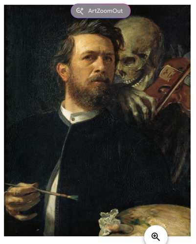

# Индивидуальная самостоятельная работа

**Дисциплина:** мировые информационные ресурсы и цифровые библиотеки  
**Тема:** онлайн-посещение музеев мира

---

## 1. Как проходило знакомство с музеями онлайн

Для подбора площадок, где можно познакомиться с музейными коллекциями без поездки, использовались обзорные материалы в сети, в том числе публикация на `Pikabu` с подборкой виртуальных музеев и экскурсий: [https://pikabu.ru/story/9_muzeev_mira_kotoryie_mozhno_posetit_ne_vyikhodya_iz_doma_4733627](https://pikabu.ru/story/9_muzeev_mira_kotoryie_mozhno_posetit_ne_vyikhodya_iz_doma_4733627).

Онлайн-доступ к мировым собраниям сегодня обычно реализован через:

- **официальные сайты музеев** с каталогами и высоким разрешением изображений;
- **агрегаторы**, такие как **Google Arts & Culture**, где собраны произведения разных учреждений, удобен поиск по авторам и музеям, есть пояснительные тексты и связанные материалы.

Такой формат позволяет просмотреть экспонат в деталях, прочитать описание и узнать, в каком музее хранится оригинал.

---

## 2. Экспонат, произведший сильное впечатление

### Название и автор

**Автопортрет со Смертью, играющей на скрипке** (*Self-Portrait with Death Playing the Fiddle*).  
**Автор:** Арнольд Бёклин (Arnold Böcklin).  
**Год:** 1872.  
**Техника:** масло, холст.  
**Размеры:** около 75 × 61 см.  
**Хранение:** Старая национальная галерея (*Alte Nationalgalerie*), Государственные музеи Берлина, Германия.

Страница произведения в проекте **Google Arts & Culture**:  
[https://artsandculture.google.com/asset/self-portrait-with-death-playing-the-fiddle-arnold-b%C3%B6cklin/qQFJu2y_sT8mlg](https://artsandculture.google.com/asset/self-portrait-with-death-playing-the-fiddle-arnold-b%C3%B6cklin/qQFJu2y_sT8mlg)

---

### Иллюстрация (скриншот просмотра на Google Arts & Culture)

*Рис. 1. Арнольд Бёклин. «Автопортрет со Смертью, играющей на скрипке» (фрагмент экрана онлайн-ресурса).*

---

### Почему картина запомнилась

На полотне художник изображён с кистью и палитрой, он смотрит на зрителя. За его плечом — олицетворение **Смерти** в виде скелета, играющего на скрипке. Композиция отсылает к традиции **memento mori** («помни о смерти»): напоминанию о конечности жизни, характерному для европейского искусства.

По текстам на странице Google Arts & Culture отмечается, что на скрипке остаётся **одна струна** (нижняя, «соль»), и что образ Смерти со скрипкой связан с визуальными источниками эпохи Возрождения и гравюрами на тему «пляски смерти», в частности с творчеством **Ганса Гольбейна Младшего**, знакомого Бёклину.

Сильное впечатление производит **напряжение между двумя планами**:

1. **Творческий акт** — живой человек продолжает писать картину, то есть создавать нечто устойчивое и передаваемое будущим поколениям.  
2. **Символический фон** — Смерть как неизбежный спутник существования, «звучащий» рядом, буквально на уровне метафоры — музыкой на одной струне.

Таким образом, полотно одновременно про **самосознание художника**, про **роль искусства** и про **философский взгляд на время**. Для зрителя, который знакомится с работой через экран, это особенно наглядно: крупный план и подписи на портале подчёркивают детали лица, кисти, скелета и инструмента — то, что в очном музее иногда сложнее рассмотреть с близкого расстояния из-за освещения и дистанции до полотна.

---

## 3. Вывод

Онлайн-посещение коллекций через **Google Arts & Culture** и подобные ресурсы даёт возможность **выбрать один экспонат** и разобрать его содержание и контекст: автор, дата, музей, техника, смысловые традиции. Картина Бёклина показалась удачным примером того, как **одно произведение** может сжато выразить **универсальные темы** — творчество, память, время и человеческое достоинство перед лицом неизбежности.

---

## Источники

1. Google Arts & Culture. *Self-Portrait with Death Playing the Fiddle* — Arnold Böcklin: [https://artsandculture.google.com/asset/self-portrait-with-death-playing-the-fiddle-arnold-b%C3%B6cklin/qQFJu2y_sT8mlg](https://artsandculture.google.com/asset/self-portrait-with-death-playing-the-fiddle-arnold-b%C3%B6cklin/qQFJu2y_sT8mlg) (дата обращения: 11.04.2026).  
2. Pikabu. «9 музеев мира, которые можно посетить, не выходя из дома»: [https://pikabu.ru/story/9_muzeev_mira_kotoryie_mozhno_posetit_ne_vyikhodya_iz_doma_4733627](https://pikabu.ru/story/9_muzeev_mira_kotoryie_mozhno_posetit_ne_vyikhodya_iz_doma_4733627) (дата обращения: 11.04.2026).
