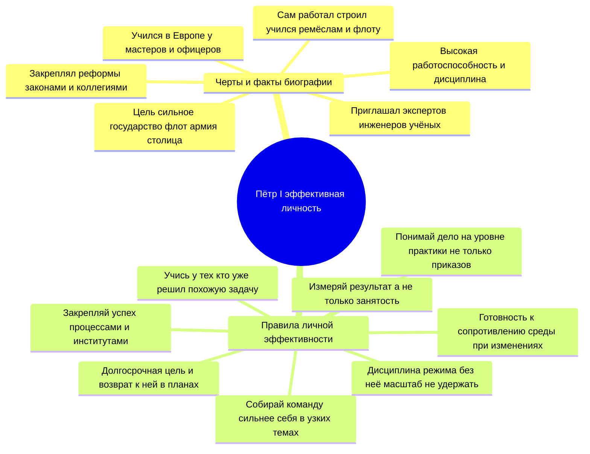

# Задание 12.1. Постер «Эффективная личность» (на материале задания 12)

```mermaid
mindmap
  root((Пётр I эффективная личность))
    Черты и факты биографии
      Цель сильное государство флот армия столица
      Учился в Европе у мастеров и офицеров
      Сам работал строил учился ремёслам и флоту
      Приглашал экспертов инженеров учёных
      Закреплял реформы законами и коллегиями
      Высокая работоспособность и дисциплина
    Правила личной эффективности
      Долгосрочная цель и возврат к ней в планах
      Учись у тех кто уже решил похожую задачу
      Понимай дело на уровне практики не только приказов
      Собирай команду сильнее себя в узких темах
      Закрепляй успех процессами и институтами
      Дисциплина режима без неё масштаб не удержать
      Готовность к сопротивлению среды при изменениях
      Измеряй результат а не только занятость
```
