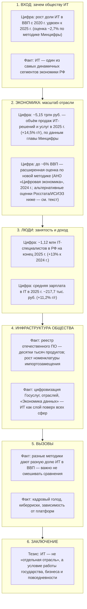

# Практическое задание 2 — вариативная часть

**Тема:** информационное общество; ИТ и жизнь гражданина.

---

## Задание 3

**Сформулировать и представить в виде инфографики план выступления** по теме:

*«ИТ-сфера: роль и место в современном обществе в цифрах и фактах»*.

---

## Инфографика: план выступления (структура и опорные факты)

---

## Блоки «как на плакате» (для слайда или постера)

| Блок выступления | Крупная цифра / факт | Что сказать устно (1–2 фразы) |
|------------------|----------------------|--------------------------------|
| **Вступление** | **×2** — доля IT в ВВП с 2020 по 2025 выросла примерно вдвое (оценка Минцифры: **2,7%** в 2025 г.) | ИТ перестаёт быть «узкой нишей»: от неё зависит темп модернизации всей экономики. |
| **Роль в ВВП** | **6%** (2024, методика АНО «Цифровая экономика») *или* **2,2–2,7%** (оценки премьера / Минцифры по иным методикам) | Назвать **одну** основную цифру и пояснить, что показатели зависят от **определения границ** отрасли. |
| **Оборот отрасли** | **5,15 трлн руб.** (2025), рост **14,5%** | Это спрос на софт, интеграцию, облака, ИБ — цифровой контур бизнеса. |
| **Занятость** | **~1,12 млн** специалистов, **+13%** за год | Высокая доля молодых кадров и миграция спроса в сторону ИИ и продуктовых ролей. |
| **Доход** | **~217,7 тыс. руб.** среднемесячно (2025) | ИТ — один из драйверов **социальной мобильности** и налоговой базы (аккуратно: региональные различия). |
| **Место в обществе** | **29,6 тыс.**+ продуктов в реестре ОПО (рост **~20%** за 2025 г., по данным Минцифры) | Государство и бизнес **закрепляют** использование отечественного ПО; ИТ — инструмент **суверенитета** и устойчивости. |
| **Риски** | Киберугрозы, нехватка кадров, «пузыри» ожиданий от ИИ | Ответственное развитие = регулирование + образование + этика данных. |
| **Заключение** | ИТ = **инфраструктура повседневности** (связь, медицина, образование, госуслуги) | Приглашение к дискуссии: как обществу балансировать инновации и включённость. |

*Оценки по ВВП, обороту, занятости и зарплатам в строках таблицы согласуются с публичными выступлениями **М.В. Шадаева** (Минцифра) и обзорами в **«Ведомостях»** (2026), **«Коммерсанте»** (методика 6% ВВП, 2024–2025). При защите уточните дату официальной статистики.*

---

## Источники для цифр в инфографике (для списка литературы)

1. Шадаев о доле IT в ВВП 2,7% (2025), оборот 5,15 трлн руб., 1,12 млн специалистов, зарплата 217,7 тыс. руб. // Ведомости [электронный ресурс]. — URL: [https://www.vedomosti.ru/economics/news/2026/02/18/1177277-shadaev-dolya](https://www.vedomosti.ru/economics/news/2026/02/18/1177277-shadaev-dolya) (дата обращения: 11.04.2026).  
2. Вклад ИТ в ВВП до 6% по новой методике, ~1,497 млн занятых, налоги и ФОТ // Коммерсантъ [электронный ресурс]. — URL: [https://www.kommersant.ru/doc/8250125](https://www.kommersant.ru/doc/8250125) (дата обращения: 11.04.2026).  
3. Мишустин: около 2,2% ВВП (оценка по итогам 2024 г.) // Ведомости [электронный ресурс]. — URL: [https://www.vedomosti.ru/economics/articles/2025/01/31/1089571-it-sektor-22-vvp](https://www.vedomosti.ru/economics/articles/2025/01/31/1089571-it-sektor-22-vvp) (дата обращения: 11.04.2026).  
