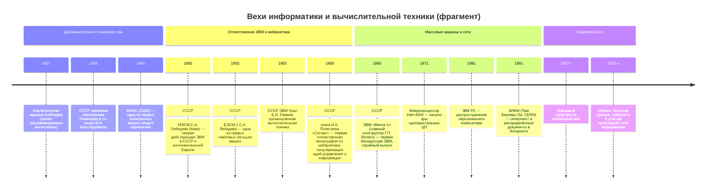

# Практическое задание 4 — индивидуальная часть (ИСР)

```mermaid
timeline
    title Вехи информатики и вычислительной техники (фрагмент)
    section Докомпьютерная и ламповая эра
        1837 : Аналитическая машина Бэббиджа (проект программируемого вычисления)
        1938 : СССР ламповая электроника Ленинград в т.ч. линия М.А. Бонч-Бруевича
        1945 : ENIAC (США) — одна из первых электронных машин общего назначения
    section Отечественная ЭВМ и кибернетика
        1950 : СССР: МЭСМ С.А. Лебедева (Киев) — первая действующая ЭВМ в СССР и континентальной Европе
        1953 : СССР: БЭСМ-1 С.А. Лебедева — одна из первых ламповых больших машин
        1955 : СССР ЭВМ Урал Б.И. Рамеев промышленная вычислительная техника
        1958 : СССР: книга И.А. Полетаева «Сигнал» — первая отечественная монография по кибернетике; популяризация идей управления и информации
    section Массовые машины и сети
        1960 : СССР: ЭВМ «Минск-1» (главный конструктор Г.П. Лопато) — первая белорусская ЭВМ, серийный выпуск
        1971 : Микропроцессор Intel 4004 — начало эры однокристальных ЦП
        1981 : IBM PC — распространение персонального компьютера
        1991 : WWW (Тим Бернерс-Ли, CERN) — гипертекст и распределённые документы в Интернете
    section Современность
        2007+ : Массовый смартфон и мобильный веб
        2020-е : Облако, большие данные, нейросети и LLM как прикладной слой информатики
```
