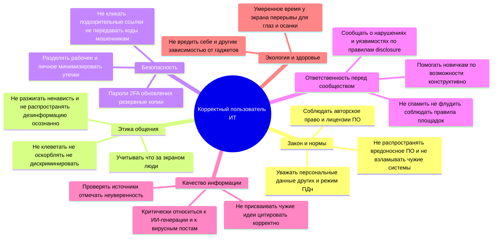

```mermaid
mindmap
  root((Корректный пользователь ИТ))
    Закон и нормы
      Соблюдать авторское право и лицензии ПО
      Не распространять вредоносное ПО и не взламывать чужие системы
      Уважать персональные данные других и режим ПДн
    Этика общения
      Не клеветать не оскорблять не дискриминировать
      Не разжигать ненависть и не распространять дезинформацию осознанно
      Учитывать что за экраном люди
    Безопасность
      Пароли 2FA обновления резервные копии
      Не кликать подозрительные ссылки не передавать коды мошенникам
      Разделять рабочее и личное минимизировать утечки
    Ответственность перед сообществом
      Не спамить не флудить соблюдать правила площадок
      Помогать новичкам по возможности конструктивно
      Сообщать о нарушениях и уязвимостях по правилам disclosure
    Качество информации
      Проверять источники отмечать неуверенность
      Не присваивать чужие идеи цитировать корректно
      Критически относиться к ИИ-генерации и к вирусным постам
    Экология и здоровье
      Умеренное время у экрана перерывы для глаз и осанки
      Не вредить себе и другим зависимостью от гаджетов
```
