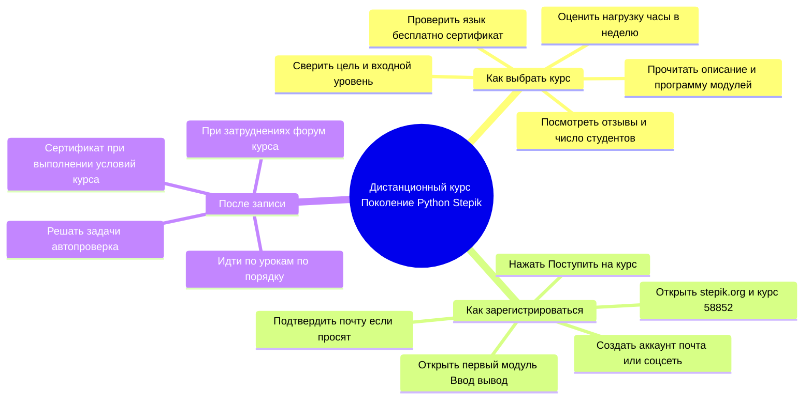

# Задание 7.1. Постер-инфографика: выбор и регистрация на дистанционный курс

```mermaid
mindmap
  root((Дистанционный курс Поколение Python Stepik))
    Как выбрать курс
      Сверить цель и входной уровень
      Прочитать описание и программу модулей
      Оценить нагрузку часы в неделю
      Проверить язык бесплатно сертификат
      Посмотреть отзывы и число студентов
    Как зарегистрироваться
      Открыть stepik.org и курс 58852
      Создать аккаунт почта или соцсеть
      Нажать Поступить на курс
      Подтвердить почту если просят
      Открыть первый модуль Ввод вывод
    После записи
      Идти по урокам по порядку
      Решать задачи автопроверка
      При затруднениях форум курса
      Сертификат при выполнении условий курса
```
