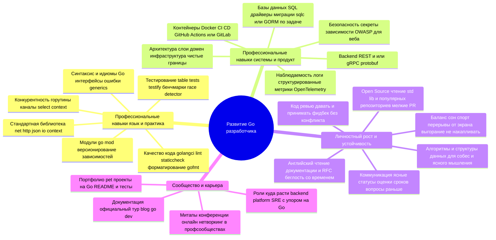

# Интеллект-карта: план развития (фокус — **Go / Golang**)

Ниже — направления **профессиональных навыков** и **личностного роста** в виде диаграммы Mermaid `mindmap`.

```mermaid
mindmap
  root((Развитие Go разработчика))
    Профессиональные навыки язык и практика
      Синтаксис и идиомы Go интерфейсы ошибки generics
      Модули go mod версионирование зависимостей
      Конкурентность горутины каналы select context
      Стандартная библиотека net http json io context
      Тестирование table tests testify бенчмарки race detector
      Качество кода golangci lint staticcheck форматирование gofmt
    Профессиональные навыки системы и продукт
      Backend REST и или gRPC protobuf
      Базы данных SQL драйверы миграции sqlc или GORM по задаче
      Наблюдаемость логи структурированные метрики OpenTelemetry
      Контейнеры Docker CI CD GitHub Actions или GitLab
      Безопасность секреты зависимости OWASP для веба
      Архитектура слои домен инфраструктура чистые границы
    Личностный рост и устойчивость
      Английский чтение документации и RFC беглость со временем
      Алгоритмы и структуры данных для собес и ясного мышления
      Код ревью давать и принимать фидбек без конфликта
      Open Source чтение std lib и популярных репозиториев мелкие PR
      Коммуникация ясные статусы оценки сроков вопросы раньше
      Баланс сон спорт перерывы от экрана выгорание не накапливать
    Сообщество и карьера
      Документация официальный тур blog go dev
      Митапы конференции онлайн нетворкинг в профсообществах
      Портфолио pet проекты на Go README и тесты
      Роли куда расти backend platform SRE с упором на Go
```
