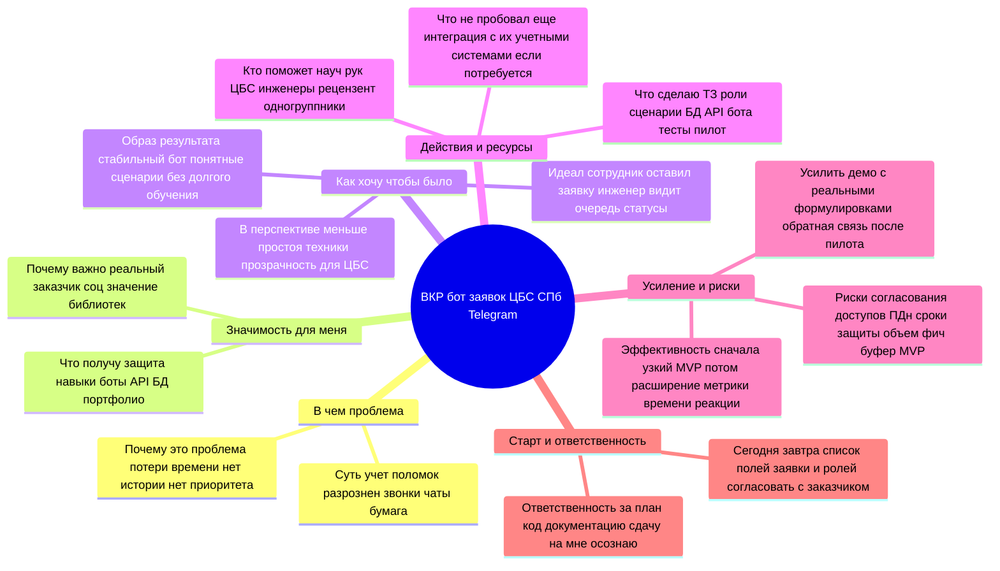

# Задание 9.1. Интеллект-карта решения задачи выполнения проекта (на примере **ВКР**)

```mermaid
mindmap
  root((ВКР бот заявок ЦБС СПб Telegram))
    В чем проблема
      Суть учет поломок разрознен звонки чаты бумага
      Почему это проблема потери времени нет истории нет приоритета
    Значимость для меня
      Почему важно реальный заказчик соц значение библиотек
      Что получу защита навыки боты API БД портфолио
    Как хочу чтобы было
      Идеал сотрудник оставил заявку инженер видит очередь статусы
      Образ результата стабильный бот понятные сценарии без долгого обучения
      В перспективе меньше простоя техники прозрачность для ЦБС
    Действия и ресурсы
      Что сделаю ТЗ роли сценарии БД API бота тесты пилот
      Кто поможет науч рук ЦБС инженеры рецензент одногруппники
      Что не пробовал еще интеграция с их учетными системами если потребуется
    Усиление и риски
      Усилить демо с реальными формулировками обратная связь после пилота
      Риски согласования доступов ПДн сроки защиты объем фич буфер MVP
      Эффективность сначала узкий MVP потом расширение метрики времени реакции
    Старт и ответственность
      Сегодня завтра список полей заявки и ролей согласовать с заказчиком
      Ответственность за план код документацию сдачу на мне осознаю
```
