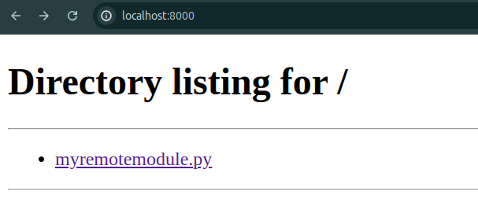

# Суворов Роман ИВТ 2.1 
## прог5 ЛР1

##### для начала создадим функцию которую будем вызывать в файле: [myremotemodule.py](code/rootserver/myremotemodule.py) в папке rootserver

---

#### создаем файл [activation_script.py](code/activation_script.py)
---

#### пробуем выполнить код без сервера:

выводится ошибка

---


#### запускаем сервер с помошью:
```text
python3 -m http.server
```


---

### после повторного запуска получаем правильный вывод:


---

# Заданиче со звездочкой:

просто добавим в вывод обработчик который будет ловить все исключения:
```py
try:
    import myremotemodule
    myremotemodule.myfoo()
except Exception:  
    print("Ошибка получения файла")
```